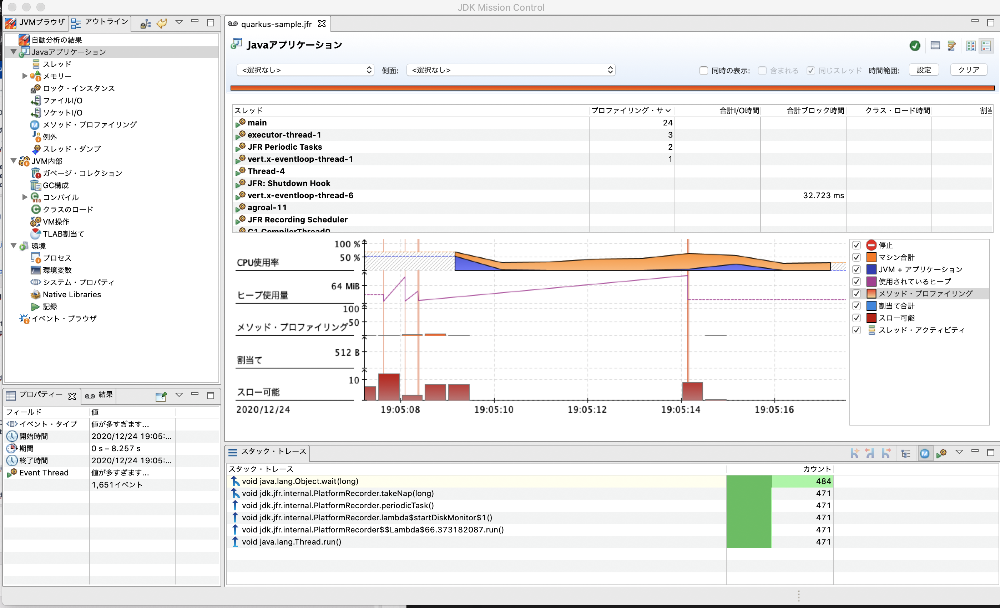
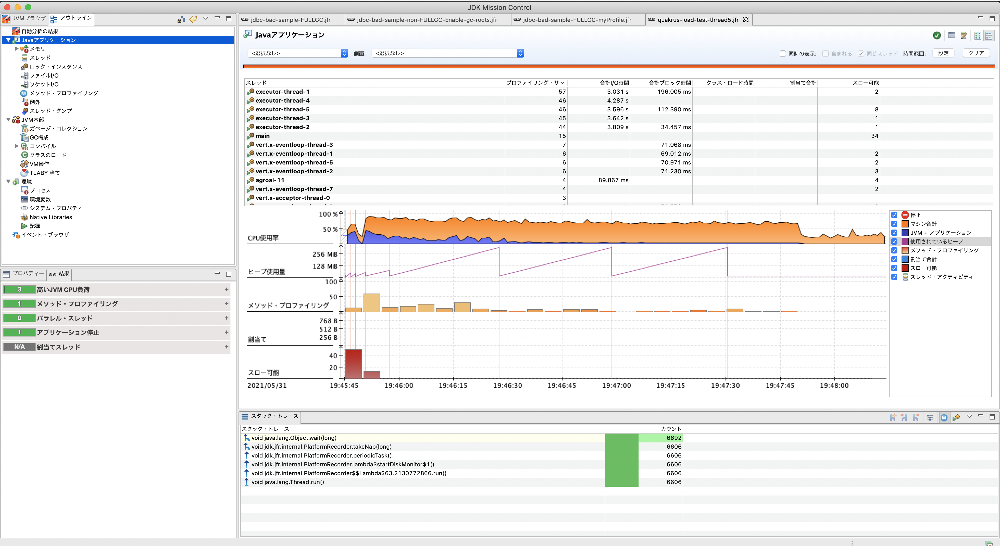
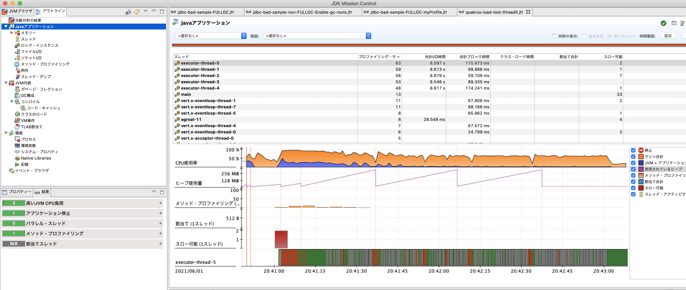
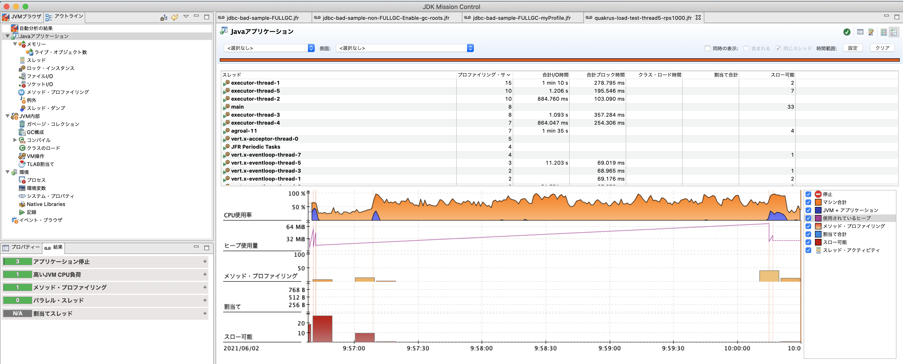
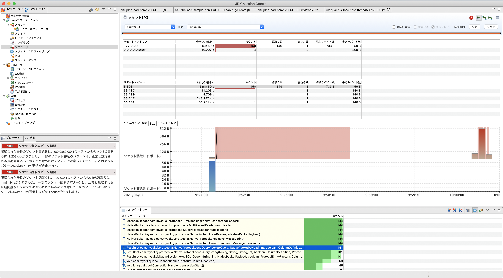
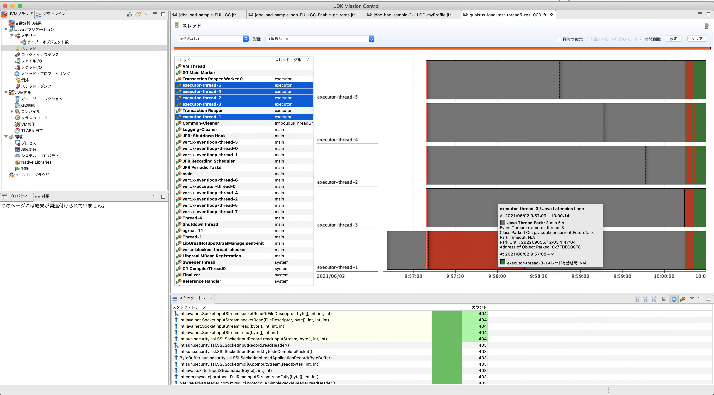
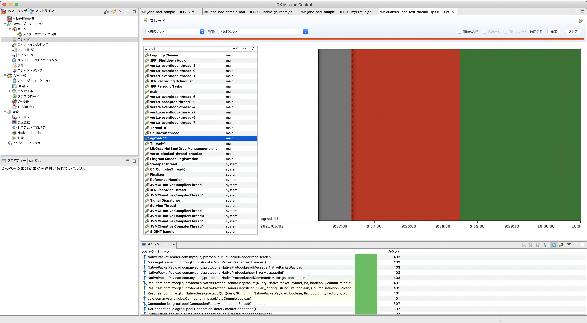

# Quakrus Memo
## 組み込みの H2 Database を利用すると native-image にできない問題

- 組み込みの H2 Database を利用している場合、以下のようなエラーが発生する
```$xslt
Error: Unsupported features in 3 methods
Detailed message:
Error: com.oracle.graal.pointsto.constraints.UnresolvedElementException: Discovered unresolved type during parsing: org.locationtech.jts.geom.Geometry. To diagnose the issue you can use the --allow-incomplete-classpath option. The missing type is then reported at run time when it is accessed the first time.
Trace:
	at parsing org.h2.value.ValueGeometry.getFromGeometry(ValueGeometry.java:99)
Call path from entry point to org.h2.value.ValueGeometry.getFromGeometry(Object):
	at org.h2.value.ValueGeometry.getFromGeometry(ValueGeometry.java:98)
	at org.h2.value.DataType.readValue(DataType.java:805)
	at org.h2.index.LinkedCursor.next(LinkedCursor.java:67)
	at org.h2.pagestore.PageStore.compact(PageStore.java:559)
	at org.h2.engine.Database.closeOpenFilesAndUnlock(Database.java:1517)
	at org.h2.engine.Database.closeImpl(Database.java:1454)
	at org.h2.engine.Database.close(Database.java:1373)
	at org.h2.engine.DelayedDatabaseCloser.run(DelayedDatabaseCloser.java:59)
	at com.oracle.svm.core.thread.JavaThreads.threadStartRoutine(JavaThreads.java:517)
	at com.oracle.svm.core.posix.thread.PosixJavaThreads.pthreadStartRoutine(PosixJavaThreads.java:193)
	at com.oracle.svm.core.code.IsolateEnterStub.PosixJavaThreads_pthreadStartRoutine_e1f4a8c0039f8337338252cd8734f63a79b5e3df(generated:0)

...
```

- 一年前の以下の stack overflow によるとサポートはされていないよう
https://stackoverflow.com/questions/56706044/h2-database-compiled-into-a-native-image-is-only-functional-as-a-client

- [PostgreSQLへのJDBCアクセスをネイティブ化する](https://nowokay.hatenablog.com/entry/2019/02/07/022233) でも同じようなエラーが発生していた
    - こちらはスタブを利用することで対応できたみたいだ
 
- `--allow-incomplete-classpath` オプションの設定は以下サイトを参考に pom.xml に記載
 - [QuarkusでHTMLを返す](http://www.natswell.com/techcolumn/2019/09/13/quarkus-html-response/)
 
- [H2 1.4.200 does not work with native-image@graalvm whereas 1.4.199 works](https://github.com/h2database/h2database/issues/2207) で紹介されていた以下のリポジトリを参考に実装してみる
    - [rmannibucau/h2graal](https://github.com/rmannibucau/h2graal)
    
- H2 Database は動作確認用だったため、ローカル開発環境として MySQL の Docker を作成する対応とする。

## Native-Image で RestEasy Client の Json の deserialize でエラーが発生する問題
- `java -jar` や `mvn compile quarkus:dev` で起動するときは問題ないが、native-image で起動すると以下のエラーが発生する 

```$xslt
2020-07-24 01:31:52,190 SEVERE [org.ecl.yas.int.Unmarshaller] (executor-thread-1) Cannot create instance of a class: class com.takaichi00.sample.quarkus.integration.dto.GoogleReadApiResponse, No default constructor found.
2020-07-24 01:31:52,192 ERROR [io.qua.ver.htt.run.QuarkusErrorHandler] (executor-thread-1) HTTP Request to /v1/books failed, error id: c43b6baa-863b-4dc0-b649-2d6ebd4e9213-1: org.jboss.resteasy.spi.UnhandledException: javax.ws.rs.ProcessingException: RESTEASY008200: JSON Binding deserialization error: javax.json.bind.JsonbException: Cannot create instance of a class: class com.takaichi00.sample.quarkus.integration.dto.GoogleReadApiResponse, No default constructor found.
	at org.jboss.resteasy.core.ExceptionHandler.handleApplicationException(ExceptionHandler.java:106)
	at org.jboss.resteasy.core.ExceptionHandler.handleException(ExceptionHandler.java:372)
	at org.jboss.resteasy.core.SynchronousDispatcher.writeException(SynchronousDispatcher.java:216)
	at org.jboss.resteasy.core.SynchronousDispatcher.invoke(SynchronousDispatcher.java:515)
	at org.jboss.resteasy.core.SynchronousDispatcher.lambda$invoke$4(SynchronousDispatcher.java:259)
	at org.jboss.resteasy.core.SynchronousDispatcher.lambda$preprocess$0(SynchronousDispatcher.java:160)
	at org.jboss.resteasy.core.interception.jaxrs.PreMatchContainerRequestContext.filter(PreMatchContainerRequestContext.java:362)
	at org.jboss.resteasy.core.SynchronousDispatcher.preprocess(SynchronousDispatcher.java:163)
	at org.jboss.resteasy.core.SynchronousDispatcher.invoke(SynchronousDispatcher.java:245)
	at io.quarkus.resteasy.runtime.standalone.RequestDispatcher.service(RequestDispatcher.java:73)
	at io.quarkus.resteasy.runtime.standalone.VertxRequestHandler.dispatch(VertxRequestHandler.java:132)
	at io.quarkus.resteasy.runtime.standalone.VertxRequestHandler.access$000(VertxRequestHandler.java:37)
	at io.quarkus.resteasy.runtime.standalone.VertxRequestHandler$1.run(VertxRequestHandler.java:94)
	at org.jboss.threads.ContextClassLoaderSavingRunnable.run(ContextClassLoaderSavingRunnable.java:35)
	at org.jboss.threads.EnhancedQueueExecutor.safeRun(EnhancedQueueExecutor.java:2046)
	at org.jboss.threads.EnhancedQueueExecutor$ThreadBody.doRunTask(EnhancedQueueExecutor.java:1578)
	at org.jboss.threads.EnhancedQueueExecutor$ThreadBody.run(EnhancedQueueExecutor.java:1452)
	at org.jboss.threads.DelegatingRunnable.run(DelegatingRunnable.java:29)
	at org.jboss.threads.ThreadLocalResettingRunnable.run(ThreadLocalResettingRunnable.java:29)
	at java.lang.Thread.run(Thread.java:834)
	at org.jboss.threads.JBossThread.run(JBossThread.java:479)
	at com.oracle.svm.core.thread.JavaThreads.threadStartRoutine(JavaThreads.java:517)
	at com.oracle.svm.core.posix.thread.PosixJavaThreads.pthreadStartRoutine(PosixJavaThreads.java:193)
Caused by: javax.ws.rs.ProcessingException: RESTEASY008200: JSON Binding deserialization error: javax.json.bind.JsonbException: Cannot create instance of a class: class com.takaichi00.sample.quarkus.integration.dto.GoogleReadApiResponse, No default constructor found.
	at org.jboss.resteasy.plugins.providers.jsonb.JsonBindingProvider.readFrom(JsonBindingProvider.java:81)
	at org.jboss.resteasy.core.interception.jaxrs.AbstractReaderInterceptorContext.readFrom(AbstractReaderInterceptorContext.java:101)
	at org.jboss.resteasy.core.interception.jaxrs.AbstractReaderInterceptorContext.proceed(AbstractReaderInterceptorContext.java:80)
	at org.jboss.resteasy.client.jaxrs.internal.ClientResponse.readFrom(ClientResponse.java:214)
	at org.jboss.resteasy.specimpl.BuiltResponse.readEntity(BuiltResponse.java:88)
	at org.jboss.resteasy.specimpl.AbstractBuiltResponse.readEntity(AbstractBuiltResponse.java:262)
	at com.takaichi00.sample.quarkus.integration.client.GoogleBooksApiClientImpl.getAllBooks(GoogleBooksApiClientImpl.java:48)
	at com.takaichi00.sample.quarkus.integration.client.GoogleBooksApiClientImpl_ClientProxy.getAllBooks(GoogleBooksApiClientImpl_ClientProxy.zig:185)
	at com.takaichi00.sample.quarkus.domain.service.BookServiceImpl.getAllBooks(BookServiceImpl.java:27)
	at com.takaichi00.sample.quarkus.domain.service.BookServiceImpl_ClientProxy.getAllBooks(BookServiceImpl_ClientProxy.zig:183)
	at com.takaichi00.sample.quarkus.application.controller.BookmarkV1Controller.getAllBooks(BookController.java:25)
	at java.lang.reflect.Method.invoke(Method.java:566)
	at org.jboss.resteasy.core.MethodInjectorImpl.invoke(MethodInjectorImpl.java:167)
	at org.jboss.resteasy.core.MethodInjectorImpl.invoke(MethodInjectorImpl.java:130)
	at org.jboss.resteasy.core.ResourceMethodInvoker.internalInvokeOnTarget(ResourceMethodInvoker.java:621)
	at org.jboss.resteasy.core.ResourceMethodInvoker.invokeOnTargetAfterFilter(ResourceMethodInvoker.java:487)
	at org.jboss.resteasy.core.ResourceMethodInvoker.lambda$invokeOnTarget$2(ResourceMethodInvoker.java:437)
	at org.jboss.resteasy.core.interception.jaxrs.PreMatchContainerRequestContext.filter(PreMatchContainerRequestContext.java:362)
	at org.jboss.resteasy.core.ResourceMethodInvoker.invokeOnTarget(ResourceMethodInvoker.java:439)
	at org.jboss.resteasy.core.ResourceMethodInvoker.invoke(ResourceMethodInvoker.java:400)
	at org.jboss.resteasy.core.ResourceMethodInvoker.invoke(ResourceMethodInvoker.java:374)
	at org.jboss.resteasy.core.ResourceMethodInvoker.invoke(ResourceMethodInvoker.java:67)
	at org.jboss.resteasy.core.SynchronousDispatcher.invoke(SynchronousDispatcher.java:488)
	... 19 more
Caused by: javax.json.bind.JsonbException: Cannot create instance of a class: class com.takaichi00.sample.quarkus.integration.dto.GoogleReadApiResponse, No default constructor found.
	at org.eclipse.yasson.internal.serializer.ObjectDeserializer.getInstance(ObjectDeserializer.java:101)
	at org.eclipse.yasson.internal.serializer.AbstractContainerDeserializer.deserialize(AbstractContainerDeserializer.java:65)
	at org.eclipse.yasson.internal.Unmarshaller.deserializeItem(Unmarshaller.java:62)
	at org.eclipse.yasson.internal.Unmarshaller.deserialize(Unmarshaller.java:51)
	at org.eclipse.yasson.internal.JsonBinding.deserialize(JsonBinding.java:59)
	at org.eclipse.yasson.internal.JsonBinding.fromJson(JsonBinding.java:99)
	at org.jboss.resteasy.plugins.providers.jsonb.JsonBindingProvider.readFrom(JsonBindingProvider.java:73)
	... 41 more
```

- Google Books Api のレスポンス Json を deserialize する際にエラーが発生するようだ
    - 試しに Http Request する処理をコメントアウトして、リクエストを mock で返してみるとエラーは発生しないため、Quarkus が返却する Json では問題がないよう
    - Jsonb の問題というよりかは　Rest Client の問題か？ 

### 解決策
- [参考サイト](https://github.com/quarkusio/quarkus/issues/6537)
    - reflection の設定を加えることで解決することができた
- [Jacksonを利用することでも解決はできるよう](https://github.com/quarkusio/quarkus/issues/5906)
    - しかし Jackson では Response Json で返却されるフィールドを全てクラス定義しないといけなくなり、大変だったため reflection の方法で解決


## 1.5.0Final → 1.6.1Final の際に発生したエラー

- Compile, Native image 起動は問題ないものの、既存の `BookRepositoryImplTest`, `GoogleBooksApiClientImplTest` を実行すると以下のエラーが発生する。
```
java.lang.RuntimeException: java.lang.RuntimeException: io.quarkus.builder.BuildException: Build failure: Build failed due to errors
	[error]: Build step io.quarkus.vertx.core.deployment.VertxCoreProcessor#ioThreadDetector threw an exception: java.lang.IllegalArgumentException: Unsupported api 524288
	at org.objectweb.asm.ClassVisitor.<init>(ClassVisitor.java:70)
	at io.quarkus.gizmo.GizmoClassVisitor.<init>(GizmoClassVisitor.java:22)
	at io.quarkus.gizmo.ClassCreator.writeTo(ClassCreator.java:150)
	at io.quarkus.gizmo.ClassCreator.close(ClassCreator.java:203)
	at io.quarkus.deployment.proxy.ProxyFactory.doDefineClass(ProxyFactory.java:189)
	at io.quarkus.deployment.proxy.ProxyFactory.defineClass(ProxyFactory.java:120)
```

- GitHub の issue で同様の事象を発見
    - [Quarkus org.graalvm.nativeimage.svm IllegalArgumentException: Unsupported api 524288 ClassVisitor Gizmo #10498](https://github.com/quarkusio/quarkus/issues/10498)
    - [Failed to run @QuarkusTest. Unsupported api 524288. After update quarkus plugin version
](https://stackoverflow.com/questions/62969042/failed-to-run-quarkustest-unsupported-api-524288-after-update-quarkus-plugin)
        - こちらのサイトにあるように、`quarkus-junit5-mockito` の依存を削除したらテストが成功するようになった。

## Mock Test
### 参考文献
- https://quarkus.io/guides/getting-started-testing#mock-support
- https://rheb.hatenablog.com/entry/quarkus_cdi_mock
- https://github.com/quarkusio/quarkus/blob/3a5680ea367c5dad60655dcef0ca9765f14d5efe/docs/src/main/asciidoc/getting-started-testing.adoc#73-mocking-with-panache

## 201 Created かつ Location Header を設定する方法

- 以下サイトを参考に実装
    - https://stackoverflow.com/questions/26092318/create-response-with-location-header-in-jax-rs

## MicroProfile REST Client を利用する際、設定を間違えた Client を Injection すると 404 NotFound になってしまう
- [QUARKUS - USING THE REST CLIENT](https://quarkus.io/guides/rest-client) を参考に Google Books API のクライアントを作成しようとした
- GoogleBooks API の URL は https://www.googleapis.com/books/v1/volumes?q={isbn} の形式
 - 例えば `volumes` の Path を `volumesaaa` のように間違えると、@RegisterClient をつけた Client が 404 Error を返却するのではなく、@RegisterClient を Inject しているエンドポイントを定義するメソッドそのものが 404 Not Found となってしまう。
 - 本来ならエンドポイント自体は機能しているので、404 Not Found ではなく 500系のエラーを返してほしいところ

## コンテナ化
- 最初からある Dockerfile.native のイメージは `registry.access.redhat.com/ubi8/ubi-minimal:8.1` で、267MB ほど
- ubuntu:18.04 のベースイメージを使うと 223MB ほど
- alpine でも実施してみたが `error while loading shared libraries: libstdc++.so.6` が発生。以下参考。
    - https://github.com/quarkusio/quarkus/issues/4647
        - native image の実行には glibc が必要
    - https://www.labohyt.net/blog/server/post-3309/
        - こちらのサイトを参考に Dockerfile に設定を追加
        - しかし `./application: error while loading shared libraries: libstdc++.so.6: cannot open shared object file: No such file or directory` というエラーが発生。
    - https://github.com/quarkusio/quarkus-images/issues/61
    - https://qiita.com/MiCHiLU/items/1e80a5325b2746eaf2d4 によれば、source から build が必要のよう。断念。

# "Execution data for class xxx does not match." という warning が出て jacoco の test coverage が計測できない
```
$ mvn clean test
...
[WARNING] Classes in bundle 'quarkus-sample' do not match with execution data. For report generation the same class files must be used as at runtime.
[WARNING] Execution data for class com/takaichi00/sample/quarkus/application/controller/BookmarkV1Controller does not match.
[WARNING] Execution data for class com/takaichi00/sample/quarkus/application/controller/BookV1Controller does not match.
[WARNING] Execution data for class com/takaichi00/sample/quarkus/integration/entity/BookEntity does not match.
```

## 原因
- BookV1Controller は Constructor Injection をしており、以下のような実装となっていた
```
@Path("/v1/books")
@RequiredArgsConstructor(onConstructor = @__({@Inject}))
public class BookV1Controller {

  private final BookService bookService;
  ...

```

- 以下のように `@RequiredArgsConstructor(onConstructor = @__({@Inject}))` を利用しないようにしてもダメだった
    - しかし、BookServiceImpl では以下のように Constructor Injection をしているにもかかわらず jacoco による test coverage が出力されている
    - `@QuakrusTest` アノテーションが関係しているのかも?
```
@Path("/v1/books")
public class BookV1Controller {

  private final BookService bookService;

  public BookV1Controller(BookService bookService) {
    this.bookService = bookService;
  }
```

- 試しに BookV2Controller を Constructor Injection にしてみると、上記同様に以下のエラーがでた。よって `@QuarkusTest` と Constructor Injection 原因そう
```
Execution data for class com/takaichi00/sample/quarkus/application/controller/BookV2Controller does not match.
```

- 詳しい原因については TODO

## 解決策

- 以下のように、Field Injection に変更すると `Execution data for class com/takaichi00/sample/quarkus/application/controller/BookV1Controller does not match.`  は出力されず、test coverage も出力されるようになった。
```
@Path("/v1/books")
public class BookV1Controller {

  @Inject
  BookService bookService;
  ...
```

# JFR
- Quarkus アプリの jar を作成
```
mvn clean package
```

- 起動
    - アプリケーションを終了すると target 配下に quarkus-sample.jfr が生成されている
```
java -XX:StartFlightRecording=dumponexit=true,filename=./target/quarkus-sample.jfr -jar target/quarkus-sample-0.0.1-SNAPSHOT-runner.jar
```

- JMC を起動
    - 「ファイル(F)」→「ファイルを開く」から生成した quarkus-sample.jfr を選択すると以下のように分析結果が表示されている



## Manage Thread Pool
- [Quarkus の HTTP レイヤーのスレッドプールについて](https://rheb.hatenablog.com/entry/quarkus-threadpool-20191220) によると、「Quarkus 1.1.0.Final 以降からは、Quarkus RESTEasy では Vert.x スレッドプールは使われなくなり、Servlet 依存の有無によらず quarkus.thread-pool.max-threads で設定される main のスレッドプールが利用されるように動作が変更され」るとの記載がある
    - `application.properties` に `quarkus.thread-pool.max-threads` を設定して、Thread Dump を取得してみる
- 一方で、https://stackoverflow.com/questions/64493361/how-to-setting-http-thread-pool-max-size-on-quarkus によれば以下も関連してそうなので調査してみる
    - `quarkus.http.io-threads`
    - `quarkus.vertx.worker-pool-size` 
### quarkus.thread-pool.max-threads で Thread Dump を取得
- [README](https://github.com/Takaichi00/quarkus-sample) に従い、アプリケーションを起動

- vegeta で一定の負荷をかけながらリクエストを実施
    - ※ [vegeta コマンドのインストール](https://github.com/chidakiyo/vegeta)が必要
```
./load-test/vegeta.sh
```

- `quarkus.thread-pool.max-threads=5` の場合
    - application を起動し、以下のコマンドを実行して Thread Dump を取得 
```
$ jstack -e `jps | grep quarkus | awk '{print $1}'` > ./output/threaddump-thread5.txt
```

- `quarkus.thread-pool.max-threads=20` の場合
```
$ jstack -e `jps | grep quarkus | awk '{print $1}'` > ./output/threaddump-thread20.txt
```

### 確認
- `executor-thread-x` というスレッドが、`quarkus.thread-pool.max-threads` で指定した数だけあることがわかる
- その他
    - `vert.x-worker-thread-x` というスレッドが、`quarkus.thread-pool.max-threads=20` のとき13, `quarkus.thread-pool.max-threads=5` のとき11存在している
    - `vert.x-eventloop-thread-x` というスレッドが、両者9存在している
    - `vert.x-internal-blocking-x` というスレッドが、両者20存在している
- StackTrace を見ると、`executor-thread-x` のスレッドが実際のリクエストを受け付け、処理しているように見える
→ `quarkus.thread-pool.max-threads` で指定したスレッドが実際のリクエストを受け付けるスレッドの数と見て良さそう

### 結論その1
- 実際のリクエストを実行する Thread の数は `quarkus.thread-pool.max-threads` で取得する

- Thread=5 の場合
```
$ ./vegeta.sh thread5
Requests      [total, rate, throughput]         1200, 40.03, 40.02
Duration      [total, attack, wait]             29.985s, 29.975s, 10.258ms
Latencies     [min, mean, 50, 90, 95, 99, max]  6.578ms, 11.459ms, 10.541ms, 14.921ms, 17.753ms, 25.922ms, 41.234ms
Bytes In      [total, mean]                     31200, 26.00
Bytes Out     [total, mean]                     0, 0.00
Success       [ratio]                           100.00%
Status Codes  [code:count]                      200:1200
Error Set:
```

- Thread=20 の場合
    - Thread=5のときより悪化している
```
 ./vegeta.sh thread20
Requests      [total, rate, throughput]         1200, 40.04, 40.02
Duration      [total, attack, wait]             29.982s, 29.974s, 8.272ms
Latencies     [min, mean, 50, 90, 95, 99, max]  7.85ms, 30.24ms, 12.064ms, 18.115ms, 24.64ms, 908.383ms, 1.411s
Bytes In      [total, mean]                     31200, 26.00
Bytes Out     [total, mean]                     0, 0.00
Success       [ratio]                           100.00%
Status Codes  [code:count]                      200:1200
Error Set:
```

- Thread=100 の場合
    - Thread=20 のときより悪化している
```
$ ./vegeta.sh thread100
Requests      [total, rate, throughput]         1200, 40.03, 40.02
Duration      [total, attack, wait]             29.987s, 29.974s, 12.966ms
Latencies     [min, mean, 50, 90, 95, 99, max]  8.063ms, 35.496ms, 12.365ms, 19.116ms, 25.28ms, 1.129s, 1.688s
Bytes In      [total, mean]                     31200, 26.00
Bytes Out     [total, mean]                     0, 0.00
Success       [ratio]                           100.00%
Status Codes  [code:count]                      200:1200
Error Set:
```
→ このあたりの傾向を JFR で見ても面白そう

## JFR, Memory Analyzer で解析
- Thread 5の場合、rate=250 ではすべてリクエストは成功したが、rate=300 を指定するとエラーが置き始めた
    - このあたりの差分を JFR で解析してみる
```
$ ./vegeta.sh 250
Requests      [total, rate, throughput]         1250, 250.21, 207.61
Duration      [total, attack, wait]             6.021s, 4.996s, 1.025s
Latencies     [min, mean, 50, 90, 95, 99, max]  34.21ms, 702.441ms, 842.183ms, 956.043ms, 967.096ms, 1.006s, 1.05s
Bytes In      [total, mean]                     32500, 26.00
Bytes Out     [total, mean]                     0, 0.00
Success       [ratio]                           100.00%
Status Codes  [code:count]                      200:1250
```

```
$ ./vegeta.sh 300
Requests      [total, rate, throughput]         1498, 299.72, 214.79
Duration      [total, attack, wait]             5.862s, 4.998s, 863.705ms
Latencies     [min, mean, 50, 90, 95, 99, max]  80.911µs, 747.024ms, 1.003s, 1.106s, 1.141s, 1.161s, 1.179s
Bytes In      [total, mean]                     32734, 21.85
Bytes Out     [total, mean]                     0, 0.00
Success       [ratio]                           84.05%
Status Codes  [code:count]                      0:239  200:1259
```

## JFR で解析
- Uber jar で Quakrus を起動する
    - https://quarkus.io/guides/maven-tooling#uber-jar-maven を参考にする
    - 「quarkus.package.type=uber-jar configuration option in your application.properties (or <quarkus.package.type>uber-jar</quarkus.package.type> in your pom.xml」とあるので、まずは applicaiton.properties に指定してみる
```
quarkus.package.type=uber-jar
```
- pom.xml を以下のようにコメントアウトすることで、uber-jar が生成できた
```
     <plugin>
        <groupId>io.quarkus</groupId>
        <artifactId>quarkus-maven-plugin</artifactId>
        <version>${quarkus.version}</version>
        <executions>
          <execution>
            <goals>
              <goal>build</goal>
<!--              <goal>native-image</goal>-->
            </goals>
            <configuration>
<!--              <enableHttpUrlHandler>true</enableHttpUrlHandler>-->
<!--              <additionalBuildArgs>-->
<!--                <additionalBuildArg>&#45;&#45;allow-incomplete-classpath</additionalBuildArg>-->
<!--              </additionalBuildArgs>-->
            </configuration>
          </execution>
        </executions>
      </plugin>
```

- JFR を有効にして起動
```
java \
-XX:StartFlightRecording=\
dumponexit=true,\
filename=./output/quakrus-load-test-thread5.jfr \
-Xms512M -Xmx512M -jar target/quarkus-sample-0.0.1-SNAPSHOT-runner.jar
```

- rate 250 にしたところ、ちょうどよくエラーが出た
```
$ ./vegeta.sh 250
Requests      [total, rate, throughput]         1250, 250.22, 122.55
Duration      [total, attack, wait]             6.251s, 4.996s, 1.255s
Latencies     [min, mean, 50, 90, 95, 99, max]  70.796µs, 1.006s, 1.339s, 1.882s, 1.995s, 2.175s, 2.241s
Bytes In      [total, mean]                     19916, 15.93
Bytes Out     [total, mean]                     0, 0.00
Success       [ratio]                           61.28%
Status Codes  [code:count]                      0:484  200:766
Error Set:
Get "http://localhost:8080/v1/bookmarks/isbn": dial tcp: lookup localhost: no such host
```
と、思ったが、これは file descriptor の上限に引っかかった時に出るエラーらしい
https://stackoverflow.com/questions/26228163/localhost-no-such-host-after-250-connections-in-go-when-using-responsewriter

デフォルトでは256らしいので、この上限を上げて試した方が良さそう。
まあこれはこれで jfr で解析する。
https://wilsonmar.github.io/maximum-limits/

## 250 rps / 120s (file descriptor 256)
```
Requests      [total, rate, throughput]         30000, 250.01, 246.84
Duration      [total, attack, wait]             2m0s, 2m0s, 8.871ms
Latencies     [min, mean, 50, 90, 95, 99, max]  89.239µs, 241.748ms, 24.621ms, 885.615ms, 1.083s, 1.257s, 1.386s
Bytes In      [total, mean]                     770172, 25.67
Bytes Out     [total, mean]                     0, 0.00
Success       [ratio]                           98.74%
Status Codes  [code:count]                      0:378  200:29622
Error Set:
Get "http://localhost:8080/v1/bookmarks/isbn": dial tcp: lookup localhost: no such host
```

- ヒープ使用率を見ると、適切にメモリが開放されている
- CPU 使用率は開始 45s から低くなった
- メソッドプロファイリングは起動直後に多く発生する
- 合計ブロック時間があるものと無いものの違いはなにか?

## 250 rps / 120s
```
java \
-XX:StartFlightRecording=\
dumponexit=true,\
filename=./output/quakrus-load-test-thread5.jfr \
-Xms512M -Xmx512M -jar target/quarkus-sample-0.0.1-SNAPSHOT-runner.jar
```
```
./vegeta.sh 250
Requests      [total, rate, throughput]         30000, 250.01, 250.00
Duration      [total, attack, wait]             2m0s, 2m0s, 5.704ms
Latencies     [min, mean, 50, 90, 95, 99, max]  2.93ms, 316.968ms, 7.438ms, 1.208s, 2.458s, 3.259s, 3.36s
Bytes In      [total, mean]                     780000, 26.00
Bytes Out     [total, mean]                     0, 0.00
Success       [ratio]                           100.00%
Status Codes  [code:count]                      200:30000
Error Set:
```
→ エラーは発生しなかった。大まかな傾向は変わらず。

- rps を上げてエラーが出るまで試してみる

## 1000 rps / 120s
- 1000 rps では quarkus から大量にエラーが発生し、1つもリクエストが成功しなかった。やりすぎたか。
```
java \
-XX:StartFlightRecording=\
dumponexit=true,\
filename=./output/quakrus-load-test-thread5-rps1000.jfr \
-Xms512M -Xmx512M -jar target/quarkus-sample-0.0.1-SNAPSHOT-runner.jar
```
```
./vegeta.sh 1000
Requests      [total, rate, throughput]         13942, 116.23, 0.00
Duration      [total, attack, wait]             2m30s, 2m0s, 30.002s
Latencies     [min, mean, 50, 90, 95, 99, max]  152.392ms, 1m2s, 1m2s, 1m20s, 1m23s, 1m24s, 1m54s
Bytes In      [total, mean]                     0, 0.00
Bytes Out     [total, mean]                     0, 0.00
Success       [ratio]                           0.00%
Status Codes  [code:count]                      0:13942
Error Set:
Get "http://localhost:8080/v1/bookmarks/isbn": read tcp [::1]:57443->[::1]:8080: read: connection reset by peer
Get "http://localhost:8080/v1/bookmarks/isbn": read tcp [::1]:57447->[::1]:8080: read: connection reset by peer
Get "http://localhost:8080/v1/bookmarks/isbn": read tcp [::1]:57444->[::1]:8080: read: connection reset by peer
...
Get "http://localhost:8080/v1/bookmarks/isbn": context deadline exceeded (Client.Timeout exceeded while awaiting headers)
```

```
09:58:10.728 WARN  [co.ar.at.arjuna] (Transaction Reaper Worker 0) ARJUNA012381: Action id 0:ffffc0a80267:ddb1:60b6d765:13 completed with multiple threads - thread executor-thread-1 was in progress with java.base@11.0.10/java.net.SocketInputStream.socketRead0(Native Method)
java.base@11.0.10/java.net.SocketInputStream.socketRead(SocketInputStream.java:115)
java.base@11.0.10/java.net.SocketInputStream.read(SocketInputStream.java:168)
java.base@11.0.10/java.net.SocketInputStream.read(SocketInputStream.java:140)
java.base@11.0.10/sun.security.ssl.SSLSocketInputRecord.read(SSLSocketInputRecord.java:478)
java.base@11.0.10/sun.security.ssl.SSLSocketInputRecord.readHeader(SSLSocketInputRecord.java:472)
java.base@11.0.10/sun.security.ssl.SSLSocketInputRecord.bytesInCompletePacket(SSLSocketInputRecord.java:70)
java.base@11.0.10/sun.security.ssl.SSLSocketImpl.readApplicationRecord(SSLSocketImpl.java:1355)
java.base@11.0.10/sun.security.ssl.SSLSocketImpl$AppInputStream.read(SSLSocketImpl.java:964)
java.base@11.0.10/java.io.FilterInputStream.read(FilterInputStream.java:133)
app//com.mysql.cj.protocol.FullReadInputStream.readFully(FullReadInputStream.java:64)
app//com.mysql.cj.protocol.a.SimplePacketReader.readHeader(SimplePacketReader.java:63)
app//com.mysql.cj.protocol.a.SimplePacketReader.readHeader(SimplePacketReader.java:45)
app//com.mysql.cj.protocol.a.TimeTrackingPacketReader.readHeader(TimeTrackingPacketReader.java:52)
app//com.mysql.cj.protocol.a.TimeTrackingPacketReader.readHeader(TimeTrackingPacketReader.java:41)
app//com.mysql.cj.protocol.a.MultiPacketReader.readHeader(MultiPacketReader.java:54)
app//com.mysql.cj.protocol.a.MultiPacketReader.readHeader(MultiPacketReader.java:44)
app//com.mysql.cj.protocol.a.NativeProtocol.readMessage(NativeProtocol.java:540)
app//com.mysql.cj.protocol.a.NativeProtocol.checkErrorMessage(NativeProtocol.java:710)
app//com.mysql.cj.protocol.a.NativeProtocol.sendCommand(NativeProtocol.java:649)
app//com.mysql.cj.protocol.a.NativeProtocol.sendQueryPacket(NativeProtocol.java:948)
app//com.mysql.cj.protocol.a.NativeProtocol.sendQueryString(NativeProtocol.java:894)
app//com.mysql.cj.NativeSession.execSQL(NativeSession.java:1073)
app//com.mysql.cj.jdbc.ConnectionImpl.setAutoCommit(ConnectionImpl.java:2051)
app//io.agroal.pool.ConnectionHandler.transactionStart(ConnectionHandler.java:227)
app//io.agroal.narayana.LocalXAResource.start(LocalXAResource.java:42)
app//com.arjuna.ats.internal.jta.transaction.arjunacore.TransactionImple.enlistResource(TransactionImple.java:661)
app//com.arjuna.ats.internal.jta.transaction.arjunacore.TransactionImple.enlistResource(TransactionImple.java:422)
app//io.agroal.narayana.NarayanaTransactionIntegration.associate(NarayanaTransactionIntegration.java:90)
app//io.agroal.pool.ConnectionPool.getConnection(ConnectionPool.java:222)
app//io.agroal.pool.DataSource.getConnection(DataSource.java:81)
app//io.quarkus.hibernate.orm.runtime.customized.QuarkusConnectionProvider.getConnection(QuarkusConnectionProvider.java:23)
app//org.hibernate.internal.NonContextualJdbcConnectionAccess.obtainConnection(NonContextualJdbcConnectionAccess.java:38)
app//org.hibernate.resource.jdbc.internal.LogicalConnectionManagedImpl.acquireConnectionIfNeeded(LogicalConnectionManagedImpl.java:108)
app//org.hibernate.resource.jdbc.internal.LogicalConnectionManagedImpl.getPhysicalConnection(LogicalConnectionManagedImpl.java:138)
app//org.hibernate.engine.jdbc.internal.StatementPreparerImpl.connection(StatementPreparerImpl.java:50)
app//org.hibernate.engine.jdbc.internal.StatementPreparerImpl$5.doPrepare(StatementPreparerImpl.java:149)
app//org.hibernate.engine.jdbc.internal.StatementPreparerImpl$StatementPreparationTemplate.prepareStatement(StatementPreparerImpl.java:176)
app//org.hibernate.engine.jdbc.internal.StatementPreparerImpl.prepareQueryStatement(StatementPreparerImpl.java:151)
app//org.hibernate.loader.Loader.prepareQueryStatement(Loader.java:2103)
app//org.hibernate.loader.Loader.executeQueryStatement(Loader.java:2040)
app//org.hibernate.loader.Loader.executeQueryStatement(Loader.java:2018)
app//org.hibernate.loader.Loader.doQuery(Loader.java:948)
app//org.hibernate.loader.Loader.doQueryAndInitializeNonLazyCollections(Loader.java:349)
app//org.hibernate.loader.Loader.doList(Loader.java:2849)
app//org.hibernate.loader.Loader.doList(Loader.java:2831)
app//org.hibernate.loader.Loader.listIgnoreQueryCache(Loader.java:2663)
app//org.hibernate.loader.Loader.list(Loader.java:2658)
app//org.hibernate.loader.hql.QueryLoader.list(QueryLoader.java:506)
app//org.hibernate.hql.internal.ast.QueryTranslatorImpl.list(QueryTranslatorImpl.java:400)
app//org.hibernate.engine.query.spi.HQLQueryPlan.performList(HQLQueryPlan.java:219)
app//org.hibernate.internal.SessionImpl.list(SessionImpl.java:1414)
app//org.hibernate.query.internal.AbstractProducedQuery.doList(AbstractProducedQuery.java:1625)
app//org.hibernate.query.internal.AbstractProducedQuery.list(AbstractProducedQuery.java:1593)
app//org.hibernate.query.Query.getResultList(Query.java:165)
app//com.takaichi00.sample.quarkus.integration.repository.BookmarkRepositoryImpl.getAllIsbn(BookmarkRepositoryImpl.java:32)
app//com.takaichi00.sample.quarkus.integration.repository.BookmarkRepositoryImpl_Subclass.getAllIsbn$$superaccessor2(BookmarkRepositoryImpl_Subclass.zig:370)
app//com.takaichi00.sample.quarkus.integration.repository.BookmarkRepositoryImpl_Subclass$$function$$2.apply(BookmarkRepositoryImpl_Subclass$$function$$2.zig:29)
app//io.quarkus.arc.impl.AroundInvokeInvocationContext.proceed(AroundInvokeInvocationContext.java:54)
app//io.quarkus.narayana.jta.runtime.interceptor.TransactionalInterceptorBase.invokeInOurTx(TransactionalInterceptorBase.java:127)
app//io.quarkus.narayana.jta.runtime.interceptor.TransactionalInterceptorBase.invokeInOurTx(TransactionalInterceptorBase.java:100)
app//io.quarkus.narayana.jta.runtime.interceptor.TransactionalInterceptorRequired.doIntercept(TransactionalInterceptorRequired.java:32)
app//io.quarkus.narayana.jta.runtime.interceptor.TransactionalInterceptorBase.intercept(TransactionalInterceptorBase.java:53)
app//io.quarkus.narayana.jta.runtime.interceptor.TransactionalInterceptorRequired.intercept(TransactionalInterceptorRequired.java:26)
app//io.quarkus.narayana.jta.runtime.interceptor.TransactionalInterceptorRequired_Bean.intercept(TransactionalInterceptorRequired_Bean.zig:340)
app//io.quarkus.arc.impl.InterceptorInvocation.invoke(InterceptorInvocation.java:41)
app//io.quarkus.arc.impl.AroundInvokeInvocationContext.perform(AroundInvokeInvocationContext.java:41)
app//io.quarkus.arc.impl.InvocationContexts.performAroundInvoke(InvocationContexts.java:32)
app//com.takaichi00.sample.quarkus.integration.repository.BookmarkRepositoryImpl_Subclass.getAllIsbn(BookmarkRepositoryImpl_Subclass.zig:328)
app//com.takaichi00.sample.quarkus.integration.repository.BookmarkRepositoryImpl_ClientProxy.getAllIsbn(BookmarkRepositoryImpl_ClientProxy.zig:126)
app//com.takaichi00.sample.quarkus.domain.service.BookServiceImpl.getAllBookmarksIsbn(BookServiceImpl.java:24)
app//com.takaichi00.sample.quarkus.domain.service.BookServiceImpl_ClientProxy.getAllBookmarksIsbn(BookServiceImpl_ClientProxy.zig:277)
app//com.takaichi00.sample.quarkus.application.controller.BookmarkV1Controller.getAllBookmarksIsbn(BookmarkV1Controller.java:33)
java.base@11.0.10/jdk.internal.reflect.NativeMethodAccessorImpl.invoke0(Native Method)
java.base@11.0.10/jdk.internal.reflect.NativeMethodAccessorImpl.invoke(NativeMethodAccessorImpl.java:62)
java.base@11.0.10/jdk.internal.reflect.DelegatingMethodAccessorImpl.invoke(DelegatingMethodAccessorImpl.java:43)
java.base@11.0.10/java.lang.reflect.Method.invoke(Method.java:566)
app//org.jboss.resteasy.core.MethodInjectorImpl.invoke(MethodInjectorImpl.java:170)
app//org.jboss.resteasy.core.MethodInjectorImpl.invoke(MethodInjectorImpl.java:130)
app//org.jboss.resteasy.core.ResourceMethodInvoker.internalInvokeOnTarget(ResourceMethodInvoker.java:643)
app//org.jboss.resteasy.core.ResourceMethodInvoker.invokeOnTargetAfterFilter(ResourceMethodInvoker.java:507)
app//org.jboss.resteasy.core.ResourceMethodInvoker.lambda$invokeOnTarget$2(ResourceMethodInvoker.java:457)
app//org.jboss.resteasy.core.ResourceMethodInvoker$$Lambda$412/0x0000000840530c40.get(Unknown Source)
app//org.jboss.resteasy.core.interception.jaxrs.PreMatchContainerRequestContext.filter(PreMatchContainerRequestContext.java:364)
app//org.jboss.resteasy.core.ResourceMethodInvoker.invokeOnTarget(ResourceMethodInvoker.java:459)
app//org.jboss.resteasy.core.ResourceMethodInvoker.invoke(ResourceMethodInvoker.java:419)
app//org.jboss.resteasy.core.ResourceMethodInvoker.invoke(ResourceMethodInvoker.java:393)
app//org.jboss.resteasy.core.ResourceMethodInvoker.invoke(ResourceMethodInvoker.java:68)
app//org.jboss.resteasy.core.SynchronousDispatcher.invoke(SynchronousDispatcher.java:492)
app//org.jboss.resteasy.core.SynchronousDispatcher.lambda$invoke$4(SynchronousDispatcher.java:261)
app//org.jboss.resteasy.core.SynchronousDispatcher$$Lambda$401/0x0000000840512840.run(Unknown Source)
app//org.jboss.resteasy.core.SynchronousDispatcher.lambda$preprocess$0(SynchronousDispatcher.java:161)
app//org.jboss.resteasy.core.SynchronousDispatcher$$Lambda$406/0x0000000840511c40.get(Unknown Source)
app//org.jboss.resteasy.core.interception.jaxrs.PreMatchContainerRequestContext.filter(PreMatchContainerRequestContext.java:364)
app//org.jboss.resteasy.core.SynchronousDispatcher.preprocess(SynchronousDispatcher.java:164)
app//org.jboss.resteasy.core.SynchronousDispatcher.invoke(SynchronousDispatcher.java:247)
app//io.quarkus.resteasy.runtime.standalone.RequestDispatcher.service(RequestDispatcher.java:73)
app//io.quarkus.resteasy.runtime.standalone.VertxRequestHandler.dispatch(VertxRequestHandler.java:138)
app//io.quarkus.resteasy.runtime.standalone.VertxRequestHandler.access$000(VertxRequestHandler.java:41)
app//io.quarkus.resteasy.runtime.standalone.VertxRequestHandler$1.run(VertxRequestHandler.java:93)
app//org.jboss.threads.EnhancedQueueExecutor$Task.run(EnhancedQueueExecutor.java:2415)
app//org.jboss.threads.EnhancedQueueExecutor$ThreadBody.run(EnhancedQueueExecutor.java:1436)
app//org.jboss.threads.DelegatingRunnable.run(DelegatingRunnable.java:29)
app//org.jboss.threads.ThreadLocalResettingRunnable.run(ThreadLocalResettingRunnable.java:29)
java.base@11.0.10/java.lang.Thread.run(Thread.java:834)
app//org.jboss.threads.JBossThread.run(JBossThread.java:501)

09:58:10.739 WARN  [co.ar.at.arjuna] (Transaction Reaper Worker 0) ARJUNA012108: CheckedAction::check - atomic action 0:ffffc0a80267:ddb1:60b6d765:13 aborting with 1 threads active!
09:58:10.741 WARN  [or.hi.re.tr.ba.jt.in.sy.SynchronizationCallbackCoordinatorTrackingImpl] (Transaction Reaper Worker 0) HHH000451: Transaction afterCompletion called by a background thread; delaying afterCompletion processing until the original thread can handle it. [status=4]
09:58:10.741 WARN  [co.ar.at.arjuna] (Transaction Reaper Worker 0) ARJUNA012121: TransactionReaper::doCancellations worker Thread[Transaction Reaper Worker 0,5,executor] successfully canceled TX 0:ffffc0a80267:ddb1:60b6d765:13
09:58:19.547 WARN  [co.ar.at.jta] (executor-thread-1) ARJUNA016061: TransactionImple.enlistResource - XAResource.start returned: ARJUNA016099: Unknown error code:0 for < formatId=131077, gtrid_length=35, bqual_length=36, tx_uid=0:ffffc0a80267:ddb1:60b6d765:13, node_name=quarkus, branch_uid=0:ffffc0a80267:ddb1:60b6d765:17, subordinatenodename=null, eis_name=0 >: javax.transaction.xa.XAException: Error trying to start local transaction: Communications link failure

The last packet successfully received from the server was 69,443 milliseconds ago. The last packet sent successfully to the server was 69,520 milliseconds ago.
	at io.agroal.narayana.LocalXAResource.start(LocalXAResource.java:45)
	at com.arjuna.ats.internal.jta.transaction.arjunacore.TransactionImple.enlistResource(TransactionImple.java:661)
	at com.arjuna.ats.internal.jta.transaction.arjunacore.TransactionImple.enlistResource(TransactionImple.java:422)
	at io.agroal.narayana.NarayanaTransactionIntegration.associate(NarayanaTransactionIntegration.java:90)
	at io.agroal.pool.ConnectionPool.getConnection(ConnectionPool.java:222)
	at io.agroal.pool.DataSource.getConnection(DataSource.java:81)
	at io.quarkus.hibernate.orm.runtime.customized.QuarkusConnectionProvider.getConnection(QuarkusConnectionProvider.java:23)
	at org.hibernate.internal.NonContextualJdbcConnectionAccess.obtainConnection(NonContextualJdbcConnectionAccess.java:38)
	at org.hibernate.resource.jdbc.internal.LogicalConnectionManagedImpl.acquireConnectionIfNeeded(LogicalConnectionManagedImpl.java:108)
	at org.hibernate.resource.jdbc.internal.LogicalConnectionManagedImpl.getPhysicalConnection(LogicalConnectionManagedImpl.java:138)
	at org.hibernate.engine.jdbc.internal.StatementPreparerImpl.connection(StatementPreparerImpl.java:50)
	at org.hibernate.engine.jdbc.internal.StatementPreparerImpl$5.doPrepare(StatementPreparerImpl.java:149)
	at org.hibernate.engine.jdbc.internal.StatementPreparerImpl$StatementPreparationTemplate.prepareStatement(StatementPreparerImpl.java:176)
	at org.hibernate.engine.jdbc.internal.StatementPreparerImpl.prepareQueryStatement(StatementPreparerImpl.java:151)
	at org.hibernate.loader.Loader.prepareQueryStatement(Loader.java:2103)
	at org.hibernate.loader.Loader.executeQueryStatement(Loader.java:2040)
	at org.hibernate.loader.Loader.executeQueryStatement(Loader.java:2018)
	at org.hibernate.loader.Loader.doQuery(Loader.java:948)
	at org.hibernate.loader.Loader.doQueryAndInitializeNonLazyCollections(Loader.java:349)
	at org.hibernate.loader.Loader.doList(Loader.java:2849)
	at org.hibernate.loader.Loader.doList(Loader.java:2831)
	at org.hibernate.loader.Loader.listIgnoreQueryCache(Loader.java:2663)
	at org.hibernate.loader.Loader.list(Loader.java:2658)
	at org.hibernate.loader.hql.QueryLoader.list(QueryLoader.java:506)
	at org.hibernate.hql.internal.ast.QueryTranslatorImpl.list(QueryTranslatorImpl.java:400)
	at org.hibernate.engine.query.spi.HQLQueryPlan.performList(HQLQueryPlan.java:219)
	at org.hibernate.internal.SessionImpl.list(SessionImpl.java:1414)
	at org.hibernate.query.internal.AbstractProducedQuery.doList(AbstractProducedQuery.java:1625)
	at org.hibernate.query.internal.AbstractProducedQuery.list(AbstractProducedQuery.java:1593)
	at org.hibernate.query.Query.getResultList(Query.java:165)
	at com.takaichi00.sample.quarkus.integration.repository.BookmarkRepositoryImpl.getAllIsbn(BookmarkRepositoryImpl.java:32)
	at com.takaichi00.sample.quarkus.integration.repository.BookmarkRepositoryImpl_Subclass.getAllIsbn$$superaccessor2(BookmarkRepositoryImpl_Subclass.zig:370)
	at com.takaichi00.sample.quarkus.integration.repository.BookmarkRepositoryImpl_Subclass$$function$$2.apply(BookmarkRepositoryImpl_Subclass$$function$$2.zig:29)
	at io.quarkus.arc.impl.AroundInvokeInvocationContext.proceed(AroundInvokeInvocationContext.java:54)
	at io.quarkus.narayana.jta.runtime.interceptor.TransactionalInterceptorBase.invokeInOurTx(TransactionalInterceptorBase.java:127)
	at io.quarkus.narayana.jta.runtime.interceptor.TransactionalInterceptorBase.invokeInOurTx(TransactionalInterceptorBase.java:100)
	at io.quarkus.narayana.jta.runtime.interceptor.TransactionalInterceptorRequired.doIntercept(TransactionalInterceptorRequired.java:32)
	at io.quarkus.narayana.jta.runtime.interceptor.TransactionalInterceptorBase.intercept(TransactionalInterceptorBase.java:53)
	at io.quarkus.narayana.jta.runtime.interceptor.TransactionalInterceptorRequired.intercept(TransactionalInterceptorRequired.java:26)
	at io.quarkus.narayana.jta.runtime.interceptor.TransactionalInterceptorRequired_Bean.intercept(TransactionalInterceptorRequired_Bean.zig:340)
	at io.quarkus.arc.impl.InterceptorInvocation.invoke(InterceptorInvocation.java:41)
	at io.quarkus.arc.impl.AroundInvokeInvocationContext.perform(AroundInvokeInvocationContext.java:41)
	at io.quarkus.arc.impl.InvocationContexts.performAroundInvoke(InvocationContexts.java:32)
	at com.takaichi00.sample.quarkus.integration.repository.BookmarkRepositoryImpl_Subclass.getAllIsbn(BookmarkRepositoryImpl_Subclass.zig:328)
	at com.takaichi00.sample.quarkus.integration.repository.BookmarkRepositoryImpl_ClientProxy.getAllIsbn(BookmarkRepositoryImpl_ClientProxy.zig:126)
	at com.takaichi00.sample.quarkus.domain.service.BookServiceImpl.getAllBookmarksIsbn(BookServiceImpl.java:24)
	at com.takaichi00.sample.quarkus.domain.service.BookServiceImpl_ClientProxy.getAllBookmarksIsbn(BookServiceImpl_ClientProxy.zig:277)
	at com.takaichi00.sample.quarkus.application.controller.BookmarkV1Controller.getAllBookmarksIsbn(BookmarkV1Controller.java:33)
	at java.base/jdk.internal.reflect.NativeMethodAccessorImpl.invoke0(Native Method)
	at java.base/jdk.internal.reflect.NativeMethodAccessorImpl.invoke(NativeMethodAccessorImpl.java:62)
	at java.base/jdk.internal.reflect.DelegatingMethodAccessorImpl.invoke(DelegatingMethodAccessorImpl.java:43)
	at java.base/java.lang.reflect.Method.invoke(Method.java:566)
	at org.jboss.resteasy.core.MethodInjectorImpl.invoke(MethodInjectorImpl.java:170)
	at org.jboss.resteasy.core.MethodInjectorImpl.invoke(MethodInjectorImpl.java:130)
	at org.jboss.resteasy.core.ResourceMethodInvoker.internalInvokeOnTarget(ResourceMethodInvoker.java:643)
	at org.jboss.resteasy.core.ResourceMethodInvoker.invokeOnTargetAfterFilter(ResourceMethodInvoker.java:507)
	at org.jboss.resteasy.core.ResourceMethodInvoker.lambda$invokeOnTarget$2(ResourceMethodInvoker.java:457)
	at org.jboss.resteasy.core.interception.jaxrs.PreMatchContainerRequestContext.filter(PreMatchContainerRequestContext.java:364)
	at org.jboss.resteasy.core.ResourceMethodInvoker.invokeOnTarget(ResourceMethodInvoker.java:459)
	at org.jboss.resteasy.core.ResourceMethodInvoker.invoke(ResourceMethodInvoker.java:419)
	at org.jboss.resteasy.core.ResourceMethodInvoker.invoke(ResourceMethodInvoker.java:393)
	at org.jboss.resteasy.core.ResourceMethodInvoker.invoke(ResourceMethodInvoker.java:68)
	at org.jboss.resteasy.core.SynchronousDispatcher.invoke(SynchronousDispatcher.java:492)
	at org.jboss.resteasy.core.SynchronousDispatcher.lambda$invoke$4(SynchronousDispatcher.java:261)
	at org.jboss.resteasy.core.SynchronousDispatcher.lambda$preprocess$0(SynchronousDispatcher.java:161)
	at org.jboss.resteasy.core.interception.jaxrs.PreMatchContainerRequestContext.filter(PreMatchContainerRequestContext.java:364)
	at org.jboss.resteasy.core.SynchronousDispatcher.preprocess(SynchronousDispatcher.java:164)
	at org.jboss.resteasy.core.SynchronousDispatcher.invoke(SynchronousDispatcher.java:247)
	at io.quarkus.resteasy.runtime.standalone.RequestDispatcher.service(RequestDispatcher.java:73)
	at io.quarkus.resteasy.runtime.standalone.VertxRequestHandler.dispatch(VertxRequestHandler.java:138)
	at io.quarkus.resteasy.runtime.standalone.VertxRequestHandler.access$000(VertxRequestHandler.java:41)
	at io.quarkus.resteasy.runtime.standalone.VertxRequestHandler$1.run(VertxRequestHandler.java:93)
	at org.jboss.threads.EnhancedQueueExecutor$Task.run(EnhancedQueueExecutor.java:2415)
	at org.jboss.threads.EnhancedQueueExecutor$ThreadBody.run(EnhancedQueueExecutor.java:1436)
	at org.jboss.threads.DelegatingRunnable.run(DelegatingRunnable.java:29)
	at org.jboss.threads.ThreadLocalResettingRunnable.run(ThreadLocalResettingRunnable.java:29)
	at java.base/java.lang.Thread.run(Thread.java:834)
	at org.jboss.threads.JBossThread.run(JBossThread.java:501)

09:58:19.574 WARN  [co.ar.at.jta] (executor-thread-1) ARJUNA016138: Failed to enlist XA resource io.agroal.narayana.LocalXAResource@3c512707: javax.transaction.xa.XAException: Error trying to start local transaction: Communications link failure
09:58:19.547 WARN  [co.ar.at.jta] (executor-thread-1) ARJUNA016061: TransactionImple.enlistResource - XAResource.start returned: ARJUNA016099: Unknown error code:0 for < formatId=131077, gtrid_length=35, bqual_length=36, tx_uid=0:ffffc0a80267:ddb1:60b6d765:13, node_name=quarkus, branch_uid=0:ffffc0a80267:ddb1:60b6d765:17, subordinatenodename=null, eis_name=0 >: javax.transaction.xa.XAException: Error trying to start local transaction: Communications link failure
09:58:19.577 WARN  [or.hi.en.jd.sp.SqlExceptionHelper] (executor-thread-1) SQL Error: 0, SQLState: 08003
09:58:19.577 ERROR [or.hi.en.jd.sp.SqlExceptionHelper] (executor-thread-1) No operations allowed after connection closed.
09:58:19.598 WARN  [co.ar.at.arjuna] (executor-thread-1) ARJUNA012077: Abort called on already aborted atomic action 0:ffffc0a80267:ddb1:60b6d765:13
09:58:44.810 WARN  [io.ag.pool] (agroal-11) Datasource '<default>': Communications link failure

The last packet successfully received from the server was 93,862 milliseconds ago. The last packet sent successfully to the server was 94,758 milliseconds ago.
09:58:44.824 WARN  [or.hi.en.jd.sp.SqlExceptionHelper] (executor-thread-5) SQL Error: 0, SQLState: 08S01
09:58:44.825 ERROR [or.hi.en.jd.sp.SqlExceptionHelper] (executor-thread-5) Communications link failure

The last packet successfully received from the server was 93,862 milliseconds ago. The last packet sent successfully to the server was 94,758 milliseconds ago.
09:58:44.833 WARN  [co.ar.at.arjuna] (executor-thread-5) ARJUNA012077: Abort called on already aborted atomic action 0:ffffc0a80267:ddb1:60b6d765:4
09:58:44.824 WARN  [or.hi.en.jd.sp.SqlExceptionHelper] (executor-thread-5) SQL Error: 0, SQLState: 08S01
09:58:44.825 ERROR [or.hi.en.jd.sp.SqlExceptionHelper] (executor-thread-5) Communications link failure
09:59:16.558 WARN  [io.ag.pool] (agroal-11) Datasource '<default>': Communications link failure

The last packet sent successfully to the server was 0 milliseconds ago. The driver has not received any packets from the server.
09:59:16.559 WARN  [or.hi.en.jd.sp.SqlExceptionHelper] (executor-thread-4) SQL Error: 0, SQLState: 08S01
09:59:16.559 ERROR [or.hi.en.jd.sp.SqlExceptionHelper] (executor-thread-4) Communications link failure

The last packet sent successfully to the server was 0 milliseconds ago. The driver has not received any packets from the server.
09:59:16.560 WARN  [co.ar.at.arjuna] (executor-thread-4) ARJUNA012077: Abort called on already aborted atomic action 0:ffffc0a80267:ddb1:60b6d765:3
09:59:19.647 WARN  [co.ar.at.arjuna] (Transaction Reaper) ARJUNA012117: TransactionReaper::check timeout for TX 0:ffffc0a80267:ddb1:60b6d765:1a in state  RUN
09:59:19.650 WARN  [co.ar.at.arjuna] (Transaction Reaper Worker 0) ARJUNA012095: Abort of action id 0:ffffc0a80267:ddb1:60b6d765:1a invoked while multiple threads active within it.
09:59:19.651 WARN  [co.ar.at.arjuna] (Transaction Reaper Worker 0) ARJUNA012381: Action id 0:ffffc0a80267:ddb1:60b6d765:1a completed with multiple threads - thread executor-thread-1 was in progress with java.base@11.0.10/jdk.internal.misc.Unsafe.park(Native Method)
java.base@11.0.10/java.util.concurrent.locks.LockSupport.park(LockSupport.java:194)
java.base@11.0.10/java.util.concurrent.FutureTask.awaitDone(FutureTask.java:447)
java.base@11.0.10/java.util.concurrent.FutureTask.get(FutureTask.java:190)
app//io.agroal.pool.ConnectionPool.handlerFromSharedCache(ConnectionPool.java:272)
app//io.agroal.pool.ConnectionPool.getConnection(ConnectionPool.java:219)
app//io.agroal.pool.DataSource.getConnection(DataSource.java:81)
app//io.quarkus.hibernate.orm.runtime.customized.QuarkusConnectionProvider.getConnection(QuarkusConnectionProvider.java:23)
app//org.hibernate.internal.NonContextualJdbcConnectionAccess.obtainConnection(NonContextualJdbcConnectionAccess.java:38)
app//org.hibernate.resource.jdbc.internal.LogicalConnectionManagedImpl.acquireConnectionIfNeeded(LogicalConnectionManagedImpl.java:108)
app//org.hibernate.resource.jdbc.internal.LogicalConnectionManagedImpl.getPhysicalConnection(LogicalConnectionManagedImpl.java:138)
app//org.hibernate.engine.jdbc.internal.StatementPreparerImpl.connection(StatementPreparerImpl.java:50)
app//org.hibernate.engine.jdbc.internal.StatementPreparerImpl$5.doPrepare(StatementPreparerImpl.java:149)
app//org.hibernate.engine.jdbc.internal.StatementPreparerImpl$StatementPreparationTemplate.prepareStatement(StatementPreparerImpl.java:176)
app//org.hibernate.engine.jdbc.internal.StatementPreparerImpl.prepareQueryStatement(StatementPreparerImpl.java:151)
app//org.hibernate.loader.Loader.prepareQueryStatement(Loader.java:2103)
app//org.hibernate.loader.Loader.executeQueryStatement(Loader.java:2040)
app//org.hibernate.loader.Loader.executeQueryStatement(Loader.java:2018)
app//org.hibernate.loader.Loader.doQuery(Loader.java:948)
app//org.hibernate.loader.Loader.doQueryAndInitializeNonLazyCollections(Loader.java:349)
app//org.hibernate.loader.Loader.doList(Loader.java:2849)
app//org.hibernate.loader.Loader.doList(Loader.java:2831)
app//org.hibernate.loader.Loader.listIgnoreQueryCache(Loader.java:2663)
app//org.hibernate.loader.Loader.list(Loader.java:2658)
app//org.hibernate.loader.hql.QueryLoader.list(QueryLoader.java:506)
app//org.hibernate.hql.internal.ast.QueryTranslatorImpl.list(QueryTranslatorImpl.java:400)
app//org.hibernate.engine.query.spi.HQLQueryPlan.performList(HQLQueryPlan.java:219)
app//org.hibernate.internal.SessionImpl.list(SessionImpl.java:1414)
app//org.hibernate.query.internal.AbstractProducedQuery.doList(AbstractProducedQuery.java:1625)
app//org.hibernate.query.internal.AbstractProducedQuery.list(AbstractProducedQuery.java:1593)
app//org.hibernate.query.Query.getResultList(Query.java:165)
app//com.takaichi00.sample.quarkus.integration.repository.BookmarkRepositoryImpl.getAllIsbn(BookmarkRepositoryImpl.java:32)
app//com.takaichi00.sample.quarkus.integration.repository.BookmarkRepositoryImpl_Subclass.getAllIsbn$$superaccessor2(BookmarkRepositoryImpl_Subclass.zig:370)
app//com.takaichi00.sample.quarkus.integration.repository.BookmarkRepositoryImpl_Subclass$$function$$2.apply(BookmarkRepositoryImpl_Subclass$$function$$2.zig:29)
app//io.quarkus.arc.impl.AroundInvokeInvocationContext.proceed(AroundInvokeInvocationContext.java:54)
app//io.quarkus.narayana.jta.runtime.interceptor.TransactionalInterceptorBase.invokeInOurTx(TransactionalInterceptorBase.java:127)
app//io.quarkus.narayana.jta.runtime.interceptor.TransactionalInterceptorBase.invokeInOurTx(TransactionalInterceptorBase.java:100)
app//io.quarkus.narayana.jta.runtime.interceptor.TransactionalInterceptorRequired.doIntercept(TransactionalInterceptorRequired.java:32)
app//io.quarkus.narayana.jta.runtime.interceptor.TransactionalInterceptorBase.intercept(TransactionalInterceptorBase.java:53)
app//io.quarkus.narayana.jta.runtime.interceptor.TransactionalInterceptorRequired.intercept(TransactionalInterceptorRequired.java:26)
app//io.quarkus.narayana.jta.runtime.interceptor.TransactionalInterceptorRequired_Bean.intercept(TransactionalInterceptorRequired_Bean.zig:340)
app//io.quarkus.arc.impl.InterceptorInvocation.invoke(InterceptorInvocation.java:41)
app//io.quarkus.arc.impl.AroundInvokeInvocationContext.perform(AroundInvokeInvocationContext.java:41)
app//io.quarkus.arc.impl.InvocationContexts.performAroundInvoke(InvocationContexts.java:32)
app//com.takaichi00.sample.quarkus.integration.repository.BookmarkRepositoryImpl_Subclass.getAllIsbn(BookmarkRepositoryImpl_Subclass.zig:328)
app//com.takaichi00.sample.quarkus.integration.repository.BookmarkRepositoryImpl_ClientProxy.getAllIsbn(BookmarkRepositoryImpl_ClientProxy.zig:126)
app//com.takaichi00.sample.quarkus.domain.service.BookServiceImpl.getAllBookmarksIsbn(BookServiceImpl.java:24)
app//com.takaichi00.sample.quarkus.domain.service.BookServiceImpl_ClientProxy.getAllBookmarksIsbn(BookServiceImpl_ClientProxy.zig:277)
app//com.takaichi00.sample.quarkus.application.controller.BookmarkV1Controller.getAllBookmarksIsbn(BookmarkV1Controller.java:33)
java.base@11.0.10/jdk.internal.reflect.NativeMethodAccessorImpl.invoke0(Native Method)
java.base@11.0.10/jdk.internal.reflect.NativeMethodAccessorImpl.invoke(NativeMethodAccessorImpl.java:62)
java.base@11.0.10/jdk.internal.reflect.DelegatingMethodAccessorImpl.invoke(DelegatingMethodAccessorImpl.java:43)
java.base@11.0.10/java.lang.reflect.Method.invoke(Method.java:566)
app//org.jboss.resteasy.core.MethodInjectorImpl.invoke(MethodInjectorImpl.java:170)
app//org.jboss.resteasy.core.MethodInjectorImpl.invoke(MethodInjectorImpl.java:130)
app//org.jboss.resteasy.core.ResourceMethodInvoker.internalInvokeOnTarget(ResourceMethodInvoker.java:643)
app//org.jboss.resteasy.core.ResourceMethodInvoker.invokeOnTargetAfterFilter(ResourceMethodInvoker.java:507)
app//org.jboss.resteasy.core.ResourceMethodInvoker.lambda$invokeOnTarget$2(ResourceMethodInvoker.java:457)
app//org.jboss.resteasy.core.ResourceMethodInvoker$$Lambda$412/0x0000000840530c40.get(Unknown Source)
app//org.jboss.resteasy.core.interception.jaxrs.PreMatchContainerRequestContext.filter(PreMatchContainerRequestContext.java:364)
app//org.jboss.resteasy.core.ResourceMethodInvoker.invokeOnTarget(ResourceMethodInvoker.java:459)
app//org.jboss.resteasy.core.ResourceMethodInvoker.invoke(ResourceMethodInvoker.java:419)
app//org.jboss.resteasy.core.ResourceMethodInvoker.invoke(ResourceMethodInvoker.java:393)
app//org.jboss.resteasy.core.ResourceMethodInvoker.invoke(ResourceMethodInvoker.java:68)
app//org.jboss.resteasy.core.SynchronousDispatcher.invoke(SynchronousDispatcher.java:492)
app//org.jboss.resteasy.core.SynchronousDispatcher.lambda$invoke$4(SynchronousDispatcher.java:261)
app//org.jboss.resteasy.core.SynchronousDispatcher$$Lambda$401/0x0000000840512840.run(Unknown Source)
app//org.jboss.resteasy.core.SynchronousDispatcher.lambda$preprocess$0(SynchronousDispatcher.java:161)
app//org.jboss.resteasy.core.SynchronousDispatcher$$Lambda$406/0x0000000840511c40.get(Unknown Source)
app//org.jboss.resteasy.core.interception.jaxrs.PreMatchContainerRequestContext.filter(PreMatchContainerRequestContext.java:364)
app//org.jboss.resteasy.core.SynchronousDispatcher.preprocess(SynchronousDispatcher.java:164)
app//org.jboss.resteasy.core.SynchronousDispatcher.invoke(SynchronousDispatcher.java:247)
app//io.quarkus.resteasy.runtime.standalone.RequestDispatcher.service(RequestDispatcher.java:73)
app//io.quarkus.resteasy.runtime.standalone.VertxRequestHandler.dispatch(VertxRequestHandler.java:138)
app//io.quarkus.resteasy.runtime.standalone.VertxRequestHandler.access$000(VertxRequestHandler.java:41)
app//io.quarkus.resteasy.runtime.standalone.VertxRequestHandler$1.run(VertxRequestHandler.java:93)
app//org.jboss.threads.EnhancedQueueExecutor$Task.run(EnhancedQueueExecutor.java:2415)
app//org.jboss.threads.EnhancedQueueExecutor$ThreadBody.run(EnhancedQueueExecutor.java:1436)
app//org.jboss.threads.DelegatingRunnable.run(DelegatingRunnable.java:29)
app//org.jboss.threads.ThreadLocalResettingRunnable.run(ThreadLocalResettingRunnable.java:29)
java.base@11.0.10/java.lang.Thread.run(Thread.java:834)
app//org.jboss.threads.JBossThread.run(JBossThread.java:501)

09:59:19.654 WARN  [co.ar.at.arjuna] (Transaction Reaper Worker 0) ARJUNA012108: CheckedAction::check - atomic action 0:ffffc0a80267:ddb1:60b6d765:1a aborting with 1 threads active!
09:59:19.655 WARN  [or.hi.re.tr.ba.jt.in.sy.SynchronizationCallbackCoordinatorTrackingImpl] (Transaction Reaper Worker 0) HHH000451: Transaction afterCompletion called by a background thread; delaying afterCompletion processing until the original thread can handle it. [status=4]
09:59:19.655 WARN  [co.ar.at.arjuna] (Transaction Reaper Worker 0) ARJUNA012121: TransactionReaper::doCancellations worker Thread[Transaction Reaper Worker 0,5,executor] successfully canceled TX 0:ffffc0a80267:ddb1:60b6d765:1a


09:59:44.846 WARN  [co.ar.at.arjuna] (Transaction Reaper Worker 0) ARJUNA012108: CheckedAction::check - atomic action 0:ffffc0a80267:ddb1:60b6d765:1d aborting with 1 threads active!
09:59:44.847 WARN  [or.hi.re.tr.ba.jt.in.sy.SynchronizationCallbackCoordinatorTrackingImpl] (Transaction Reaper Worker 0) HHH000451: Transaction afterCompletion called by a background thread; delaying afterCompletion processing until the original thread can handle it. [status=4]
09:59:44.847 WARN  [co.ar.at.arjuna] (Transaction Reaper Worker 0) ARJUNA012121: TransactionReaper::doCancellations worker Thread[Transaction Reaper Worker 0,5,executor] successfully canceled TX 0:ffffc0a80267:ddb1:60b6d765:1d
09:59:46.770 WARN  [io.ag.pool] (agroal-11) Datasource '<default>': Communications link failure

The last packet sent successfully to the server was 0 milliseconds ago. The driver has not received any packets from the server.
09:59:46.772 WARN  [or.hi.en.jd.sp.SqlExceptionHelper] (executor-thread-2) SQL Error: 0, SQLState: 08S01
09:59:46.773 ERROR [or.hi.en.jd.sp.SqlExceptionHelper] (executor-thread-2) Communications link failure
```

### JFR で解析 (1000rps-120s)

- 250rps の頃に比べてヒープは全然増えていない
- JVM の CPU 使用率も全然使われていない


- ソケットI/O を見ると、リモートポート 3306 で合計 I/O 時間が 2min50s となっている
    - 負荷をかけた時間が 2min なので、ほとんどの時間を MySQL のソケット通信に費やしている


- executor thread は5つともほとんど稼働していない


- agroal-11 という Thread が Mysql の Socket Read などをしているようだが、前半はほとんど Socket Read で時間を費やしている
- [QUARKUS - DATASOURCES](https://quarkus.io/guides/datasource) で、[Agroal](https://agroal.github.io/) は Connection Pool の実装として Quakrus で使われているとの記載がある
- [公式ドキュメント](https://quarkus.io/guides/datasource#quarkus-agroal_quarkus.datasource.jdbc.max-size) では、最大20のコネクションプールが存在するよう。

→ エラーが起こりつつ、正常なレスポンスが起こる rps を探す

## 500rps-120s
```
java \
-XX:StartFlightRecording=\
dumponexit=true,\
filename=./output/quakrus-load-test-thread5-rps500.jfr \
-Xms512M -Xmx512M -jar target/quarkus-sample-0.0.1-SNAPSHOT-runner.jar
```
```
./vegeta.sh 500
Requests      [total, rate, throughput]         19044, 90.61, 0.14
Duration      [total, attack, wait]             4m42s, 3m30s, 1m12s
Latencies     [min, mean, 50, 90, 95, 99, max]  858.343ms, 1m23s, 1m15s, 1m58s, 2m29s, 2m29s, 3m55s
Bytes In      [total, mean]                     1014, 0.05
Bytes Out     [total, mean]                     0, 0.00
Success       [ratio]                           0.20%
Status Codes  [code:count]                      0:19005  200:39
Error Set:
Get "http://localhost:8080/v1/bookmarks/isbn": read tcp [::1]:57712->[::1]:8080: read: connection reset by peer
Get "http://localhost:8080/v1/bookmarks/isbn": read tcp [::1]:57715->[::1]:8080: read: connection reset by peer
Get "http://localhost:8080/v1/bookmarks/isbn": read tcp [::1]:57718->[::1]:8080: read: connection reset by peer
Get "http://localhost:8080/v1/bookmarks/isbn": read tcp [::1]:57725->[::1]:8080: read: connection reset by peer
Get "http://localhost:8080/v1/bookmarks/isbn": context deadline exceeded (Client.Timeout exceeded while awaiting headers)
Get "http://localhost:8080/v1/bookmarks/isbn": read tcp [::1]:57745->[::1]:8080: read: connection reset by peer (Client.Timeout exceeded while awaiting headers)
```
→ 200 OK は微増したが、それでもエラーが多い。もう少し減らしてみる

## 300rps-120s
```
java \
-XX:StartFlightRecording=\
dumponexit=true,\
filename=./output/quakrus-load-test-thread5-rps300.jfr \
-Xms512M -Xmx512M -jar target/quarkus-sample-0.0.1-SNAPSHOT-runner.jar
```
```
./vegeta.sh 300
```
→ PC がクラッシュした。少ない rps から徐々に上げていく方針とする。

# アーキテクチャメモ
## 凹型レイヤー

- package structure
```
- application
 - controller
 - domain
 - payload
 - exceptionhandler
- domain
 - client
 - model
 - repository
 - service
- integration
 - client
 - dto
 - entity
 - repository
```

### Pro
- Front First な開発ができる
    - 後ろの層が完成していなくても Mock にすることで開発が進められる 

### Con
- ドメインモデルと値の詰替えが冗長になる
    - 例えばドメインモデルの IF が変更になると、テストも含めて影響範囲が大きい
        - レイヤーごとに単体テストを書くとドメインモデルの 1 フィールドが変更になるだけで Controller, Domain, Repository のテストに同じような修正を入れないといけない。

## オニオンアーキテクチャ
- [Reference](https://buildersbox.corp-sansan.com/entry/2019/07/10/110000)
```
- application
- domain
- infrastructure
- presentation
```
