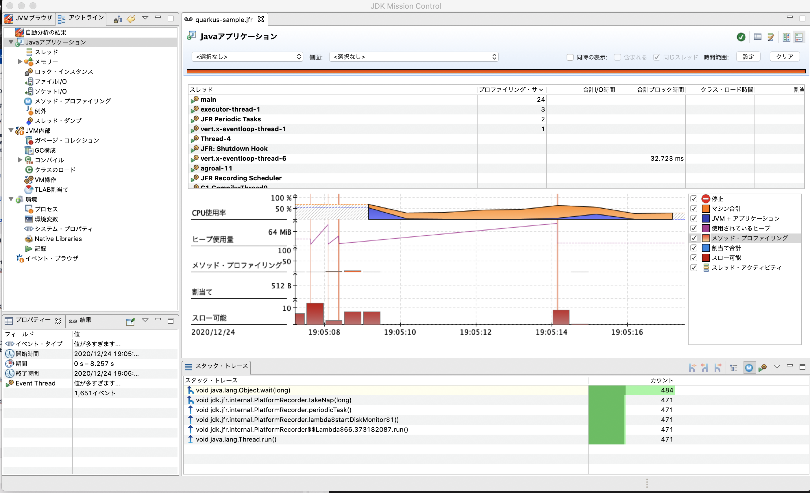

# Quakrus Memo
## 組み込みの H2 Database を利用すると native-image にできない問題

- 組み込みの H2 Database を利用している場合、以下のようなエラーが発生する
```$xslt
Error: Unsupported features in 3 methods
Detailed message:
Error: com.oracle.graal.pointsto.constraints.UnresolvedElementException: Discovered unresolved type during parsing: org.locationtech.jts.geom.Geometry. To diagnose the issue you can use the --allow-incomplete-classpath option. The missing type is then reported at run time when it is accessed the first time.
Trace:
	at parsing org.h2.value.ValueGeometry.getFromGeometry(ValueGeometry.java:99)
Call path from entry point to org.h2.value.ValueGeometry.getFromGeometry(Object):
	at org.h2.value.ValueGeometry.getFromGeometry(ValueGeometry.java:98)
	at org.h2.value.DataType.readValue(DataType.java:805)
	at org.h2.index.LinkedCursor.next(LinkedCursor.java:67)
	at org.h2.pagestore.PageStore.compact(PageStore.java:559)
	at org.h2.engine.Database.closeOpenFilesAndUnlock(Database.java:1517)
	at org.h2.engine.Database.closeImpl(Database.java:1454)
	at org.h2.engine.Database.close(Database.java:1373)
	at org.h2.engine.DelayedDatabaseCloser.run(DelayedDatabaseCloser.java:59)
	at com.oracle.svm.core.thread.JavaThreads.threadStartRoutine(JavaThreads.java:517)
	at com.oracle.svm.core.posix.thread.PosixJavaThreads.pthreadStartRoutine(PosixJavaThreads.java:193)
	at com.oracle.svm.core.code.IsolateEnterStub.PosixJavaThreads_pthreadStartRoutine_e1f4a8c0039f8337338252cd8734f63a79b5e3df(generated:0)

...
```

- 一年前の以下の stack overflow によるとサポートはされていないよう
https://stackoverflow.com/questions/56706044/h2-database-compiled-into-a-native-image-is-only-functional-as-a-client

- [PostgreSQLへのJDBCアクセスをネイティブ化する](https://nowokay.hatenablog.com/entry/2019/02/07/022233) でも同じようなエラーが発生していた
    - こちらはスタブを利用することで対応できたみたいだ
 
- `--allow-incomplete-classpath` オプションの設定は以下サイトを参考に pom.xml に記載
 - [QuarkusでHTMLを返す](http://www.natswell.com/techcolumn/2019/09/13/quarkus-html-response/)
 
- [H2 1.4.200 does not work with native-image@graalvm whereas 1.4.199 works](https://github.com/h2database/h2database/issues/2207) で紹介されていた以下のリポジトリを参考に実装してみる
    - [rmannibucau/h2graal](https://github.com/rmannibucau/h2graal)
    
- H2 Database は動作確認用だったため、ローカル開発環境として MySQL の Docker を作成する対応とする。

## Native-Image で RestEasy Client の Json の deserialize でエラーが発生する問題
- `java -jar` や `mvn compile quarkus:dev` で起動するときは問題ないが、native-image で起動すると以下のエラーが発生する 

```$xslt
2020-07-24 01:31:52,190 SEVERE [org.ecl.yas.int.Unmarshaller] (executor-thread-1) Cannot create instance of a class: class com.takaichi00.sample.quarkus.integration.dto.GoogleReadApiResponse, No default constructor found.
2020-07-24 01:31:52,192 ERROR [io.qua.ver.htt.run.QuarkusErrorHandler] (executor-thread-1) HTTP Request to /v1/books failed, error id: c43b6baa-863b-4dc0-b649-2d6ebd4e9213-1: org.jboss.resteasy.spi.UnhandledException: javax.ws.rs.ProcessingException: RESTEASY008200: JSON Binding deserialization error: javax.json.bind.JsonbException: Cannot create instance of a class: class com.takaichi00.sample.quarkus.integration.dto.GoogleReadApiResponse, No default constructor found.
	at org.jboss.resteasy.core.ExceptionHandler.handleApplicationException(ExceptionHandler.java:106)
	at org.jboss.resteasy.core.ExceptionHandler.handleException(ExceptionHandler.java:372)
	at org.jboss.resteasy.core.SynchronousDispatcher.writeException(SynchronousDispatcher.java:216)
	at org.jboss.resteasy.core.SynchronousDispatcher.invoke(SynchronousDispatcher.java:515)
	at org.jboss.resteasy.core.SynchronousDispatcher.lambda$invoke$4(SynchronousDispatcher.java:259)
	at org.jboss.resteasy.core.SynchronousDispatcher.lambda$preprocess$0(SynchronousDispatcher.java:160)
	at org.jboss.resteasy.core.interception.jaxrs.PreMatchContainerRequestContext.filter(PreMatchContainerRequestContext.java:362)
	at org.jboss.resteasy.core.SynchronousDispatcher.preprocess(SynchronousDispatcher.java:163)
	at org.jboss.resteasy.core.SynchronousDispatcher.invoke(SynchronousDispatcher.java:245)
	at io.quarkus.resteasy.runtime.standalone.RequestDispatcher.service(RequestDispatcher.java:73)
	at io.quarkus.resteasy.runtime.standalone.VertxRequestHandler.dispatch(VertxRequestHandler.java:132)
	at io.quarkus.resteasy.runtime.standalone.VertxRequestHandler.access$000(VertxRequestHandler.java:37)
	at io.quarkus.resteasy.runtime.standalone.VertxRequestHandler$1.run(VertxRequestHandler.java:94)
	at org.jboss.threads.ContextClassLoaderSavingRunnable.run(ContextClassLoaderSavingRunnable.java:35)
	at org.jboss.threads.EnhancedQueueExecutor.safeRun(EnhancedQueueExecutor.java:2046)
	at org.jboss.threads.EnhancedQueueExecutor$ThreadBody.doRunTask(EnhancedQueueExecutor.java:1578)
	at org.jboss.threads.EnhancedQueueExecutor$ThreadBody.run(EnhancedQueueExecutor.java:1452)
	at org.jboss.threads.DelegatingRunnable.run(DelegatingRunnable.java:29)
	at org.jboss.threads.ThreadLocalResettingRunnable.run(ThreadLocalResettingRunnable.java:29)
	at java.lang.Thread.run(Thread.java:834)
	at org.jboss.threads.JBossThread.run(JBossThread.java:479)
	at com.oracle.svm.core.thread.JavaThreads.threadStartRoutine(JavaThreads.java:517)
	at com.oracle.svm.core.posix.thread.PosixJavaThreads.pthreadStartRoutine(PosixJavaThreads.java:193)
Caused by: javax.ws.rs.ProcessingException: RESTEASY008200: JSON Binding deserialization error: javax.json.bind.JsonbException: Cannot create instance of a class: class com.takaichi00.sample.quarkus.integration.dto.GoogleReadApiResponse, No default constructor found.
	at org.jboss.resteasy.plugins.providers.jsonb.JsonBindingProvider.readFrom(JsonBindingProvider.java:81)
	at org.jboss.resteasy.core.interception.jaxrs.AbstractReaderInterceptorContext.readFrom(AbstractReaderInterceptorContext.java:101)
	at org.jboss.resteasy.core.interception.jaxrs.AbstractReaderInterceptorContext.proceed(AbstractReaderInterceptorContext.java:80)
	at org.jboss.resteasy.client.jaxrs.internal.ClientResponse.readFrom(ClientResponse.java:214)
	at org.jboss.resteasy.specimpl.BuiltResponse.readEntity(BuiltResponse.java:88)
	at org.jboss.resteasy.specimpl.AbstractBuiltResponse.readEntity(AbstractBuiltResponse.java:262)
	at com.takaichi00.sample.quarkus.integration.client.GoogleBooksApiClientImpl.getAllBooks(GoogleBooksApiClientImpl.java:48)
	at com.takaichi00.sample.quarkus.integration.client.GoogleBooksApiClientImpl_ClientProxy.getAllBooks(GoogleBooksApiClientImpl_ClientProxy.zig:185)
	at com.takaichi00.sample.quarkus.domain.service.BookServiceImpl.getAllBooks(BookServiceImpl.java:27)
	at com.takaichi00.sample.quarkus.domain.service.BookServiceImpl_ClientProxy.getAllBooks(BookServiceImpl_ClientProxy.zig:183)
	at com.takaichi00.sample.quarkus.application.controller.BookmarkV1Controller.getAllBooks(BookController.java:25)
	at java.lang.reflect.Method.invoke(Method.java:566)
	at org.jboss.resteasy.core.MethodInjectorImpl.invoke(MethodInjectorImpl.java:167)
	at org.jboss.resteasy.core.MethodInjectorImpl.invoke(MethodInjectorImpl.java:130)
	at org.jboss.resteasy.core.ResourceMethodInvoker.internalInvokeOnTarget(ResourceMethodInvoker.java:621)
	at org.jboss.resteasy.core.ResourceMethodInvoker.invokeOnTargetAfterFilter(ResourceMethodInvoker.java:487)
	at org.jboss.resteasy.core.ResourceMethodInvoker.lambda$invokeOnTarget$2(ResourceMethodInvoker.java:437)
	at org.jboss.resteasy.core.interception.jaxrs.PreMatchContainerRequestContext.filter(PreMatchContainerRequestContext.java:362)
	at org.jboss.resteasy.core.ResourceMethodInvoker.invokeOnTarget(ResourceMethodInvoker.java:439)
	at org.jboss.resteasy.core.ResourceMethodInvoker.invoke(ResourceMethodInvoker.java:400)
	at org.jboss.resteasy.core.ResourceMethodInvoker.invoke(ResourceMethodInvoker.java:374)
	at org.jboss.resteasy.core.ResourceMethodInvoker.invoke(ResourceMethodInvoker.java:67)
	at org.jboss.resteasy.core.SynchronousDispatcher.invoke(SynchronousDispatcher.java:488)
	... 19 more
Caused by: javax.json.bind.JsonbException: Cannot create instance of a class: class com.takaichi00.sample.quarkus.integration.dto.GoogleReadApiResponse, No default constructor found.
	at org.eclipse.yasson.internal.serializer.ObjectDeserializer.getInstance(ObjectDeserializer.java:101)
	at org.eclipse.yasson.internal.serializer.AbstractContainerDeserializer.deserialize(AbstractContainerDeserializer.java:65)
	at org.eclipse.yasson.internal.Unmarshaller.deserializeItem(Unmarshaller.java:62)
	at org.eclipse.yasson.internal.Unmarshaller.deserialize(Unmarshaller.java:51)
	at org.eclipse.yasson.internal.JsonBinding.deserialize(JsonBinding.java:59)
	at org.eclipse.yasson.internal.JsonBinding.fromJson(JsonBinding.java:99)
	at org.jboss.resteasy.plugins.providers.jsonb.JsonBindingProvider.readFrom(JsonBindingProvider.java:73)
	... 41 more
```

- Google Books Api のレスポンス Json を deserialize する際にエラーが発生するようだ
    - 試しに Http Request する処理をコメントアウトして、リクエストを mock で返してみるとエラーは発生しないため、Quarkus が返却する Json では問題がないよう
    - Jsonb の問題というよりかは　Rest Client の問題か？ 

### 解決策
- [参考サイト](https://github.com/quarkusio/quarkus/issues/6537)
    - reflection の設定を加えることで解決することができた
- [Jacksonを利用することでも解決はできるよう](https://github.com/quarkusio/quarkus/issues/5906)
    - しかし Jackson では Response Json で返却されるフィールドを全てクラス定義しないといけなくなり、大変だったため reflection の方法で解決


## 1.5.0Final → 1.6.1Final の際に発生したエラー

- Compile, Native image 起動は問題ないものの、既存の `BookRepositoryImplTest`, `GoogleBooksApiClientImplTest` を実行すると以下のエラーが発生する。
```
java.lang.RuntimeException: java.lang.RuntimeException: io.quarkus.builder.BuildException: Build failure: Build failed due to errors
	[error]: Build step io.quarkus.vertx.core.deployment.VertxCoreProcessor#ioThreadDetector threw an exception: java.lang.IllegalArgumentException: Unsupported api 524288
	at org.objectweb.asm.ClassVisitor.<init>(ClassVisitor.java:70)
	at io.quarkus.gizmo.GizmoClassVisitor.<init>(GizmoClassVisitor.java:22)
	at io.quarkus.gizmo.ClassCreator.writeTo(ClassCreator.java:150)
	at io.quarkus.gizmo.ClassCreator.close(ClassCreator.java:203)
	at io.quarkus.deployment.proxy.ProxyFactory.doDefineClass(ProxyFactory.java:189)
	at io.quarkus.deployment.proxy.ProxyFactory.defineClass(ProxyFactory.java:120)
```

- GitHub の issue で同様の事象を発見
    - [Quarkus org.graalvm.nativeimage.svm IllegalArgumentException: Unsupported api 524288 ClassVisitor Gizmo #10498](https://github.com/quarkusio/quarkus/issues/10498)
    - [Failed to run @QuarkusTest. Unsupported api 524288. After update quarkus plugin version
](https://stackoverflow.com/questions/62969042/failed-to-run-quarkustest-unsupported-api-524288-after-update-quarkus-plugin)
        - こちらのサイトにあるように、`quarkus-junit5-mockito` の依存を削除したらテストが成功するようになった。

## Mock Test
### 参考文献
- https://quarkus.io/guides/getting-started-testing#mock-support
- https://rheb.hatenablog.com/entry/quarkus_cdi_mock
- https://github.com/quarkusio/quarkus/blob/3a5680ea367c5dad60655dcef0ca9765f14d5efe/docs/src/main/asciidoc/getting-started-testing.adoc#73-mocking-with-panache

## 201 Created かつ Location Header を設定する方法

- 以下サイトを参考に実装
    - https://stackoverflow.com/questions/26092318/create-response-with-location-header-in-jax-rs

## MicroProfile REST Client を利用する際、設定を間違えた Client を Injection すると 404 NotFound になってしまう
- [QUARKUS - USING THE REST CLIENT](https://quarkus.io/guides/rest-client) を参考に Google Books API のクライアントを作成しようとした
- GoogleBooks API の URL は https://www.googleapis.com/books/v1/volumes?q={isbn} の形式
 - 例えば `volumes` の Path を `volumesaaa` のように間違えると、@RegisterClient をつけた Client が 404 Error を返却するのではなく、@RegisterClient を Inject しているエンドポイントを定義するメソッドそのものが 404 Not Found となってしまう。
 - 本来ならエンドポイント自体は機能しているので、404 Not Found ではなく 500系のエラーを返してほしいところ

## コンテナ化
- 最初からある Dockerfile.native のイメージは `registry.access.redhat.com/ubi8/ubi-minimal:8.1` で、267MB ほど
- ubuntu:18.04 のベースイメージを使うと 223MB ほど
- alpine でも実施してみたが `error while loading shared libraries: libstdc++.so.6` が発生。以下参考。
    - https://github.com/quarkusio/quarkus/issues/4647
        - native image の実行には glibc が必要
    - https://www.labohyt.net/blog/server/post-3309/
        - こちらのサイトを参考に Dockerfile に設定を追加
        - しかし `./application: error while loading shared libraries: libstdc++.so.6: cannot open shared object file: No such file or directory` というエラーが発生。
    - https://github.com/quarkusio/quarkus-images/issues/61
    - https://qiita.com/MiCHiLU/items/1e80a5325b2746eaf2d4 によれば、source から build が必要のよう。断念。

# JFR
## 参考文献
- [最初の1リクエスト目で何をしているのか？](https://b.chiroito.dev/entry/2020/09/20/212719)
- [Java Flight Recorderでトラブルシューティング](https://qiita.com/sahn/items/952f8c1fdc463fa372b4)
- [JDBC & JFR Sample](https://github.com/chiroito/Jfr4Jdbc)
- [Quarkus で JFR Event Streaming](https://b.chiroito.dev/entry/2020/05/28/185832)
- [JITとコードの暖気の実体](https://b.chiroito.dev/entry/2020/09/18/221458)
- [Rediness Probeでアプリケーションが十分にJITされたことを検知する](https://b.chiroito.dev/entry/2020/09/19/225533)
- [Java Mission Control の紹介 (JMC)](https://docs.oracle.com/javase/jp/7/technotes/guides/jmc/intro.html)
- [パフォーマンスのトラブルシュート入門](https://speakerdeck.com/chiroito/getting-started-performance-troubleshoot)
- [Java 11のFlight Recorderを試す](https://matsumana.info/blog/2018/10/16/jdk11-flight-recorder/)
- [JFR に関する情報がまとまった gitbook ページ](https://koduki.github.io/docs/book-introduction-of-jfr/site/)
    - [1.2 Javaにおけるパフォーマンス分析と障害診断](https://koduki.github.io/docs/book-introduction-of-jfr/site/01/02-other_tools.html)
        - こちらは JFR に限らず Java におけるいろいろなツール (jps, jstack, etc...)が紹介されている

## 実行メモ
- 実行時に `-XX:StartFlightRecording` をつける
    - [Java 11のFlight Recorderを試す](https://matsumana.info/blog/2018/10/16/jdk11-flight-recorder/)
```
mvn clean package -DskipTests=true
java -jar target/quarkus-sample-0.0.1-SNAPSHOT-runner.jar -XX:StartFlightRecording
```
- `jmc` コマンドを実行しようとしたが、`$JAVA_HOME` に jmc コマンドがない
    - [1.4 JFRの動作環境とJMCのインストール](https://koduki.github.io/docs/book-introduction-of-jfr/site/01/04-install_jmc.html)を参考に、docker で起動してみる
```
git clone https://github.com/openjdk/jmc.git
cd jmc
docker-compose -f docker/docker-compose.yml run jmc

...
[WARNING] Error injecting: org.eclipse.tycho.core.maven.TychoMavenLifecycleParticipant
java.lang.TypeNotPresentException: Type org.eclipse.tycho.core.maven.TychoMavenLifecycleParticipant not present
	at org.eclipse.sisu.space.URLClassSpace.loadClass(URLClassSpace.java:147)
	at org.eclipse.sisu.space.NamedClass.load(NamedClass.java:46)
	at org.eclipse.sisu.space.AbstractDeferredClass.get(AbstractDeferredClass.java:48)
	at com.google.inject.internal.ProviderInternalFactory.provision(ProviderInternalFactory.java:81)
	at com.google.inject.internal.InternalFactoryToInitializableAdapter.provision(InternalFactoryToInitializableAdapter.java:53)
	at com.google.inject.internal.ProviderInternalFactory$1.call(ProviderInternalFactory.java:65)
	at com.google.inject.internal.ProvisionListenerStackCallback$Provision.provision(ProvisionListenerStackCallback.java:115)
	at org.eclipse.sisu.bean.BeanScheduler$Activator.onProvision(BeanScheduler.java:176)
	at com.google.inject.internal.ProvisionListenerStackCallback$Provision.provision(ProvisionListenerStackCallback.java:126)
	at com.google.inject.internal.ProvisionListenerStackCallback.provision(ProvisionListenerStackCallback.java:68)
	at com.google.inject.internal.ProviderInternalFactory.circularGet(ProviderInternalFactory.java:63)
	at com.google.inject.internal.InternalFactoryToInitializableAdapter.get(InternalFactoryToInitializableAdapter.java:45)
	at com.google.inject.internal.ProviderToInternalFactoryAdapter$1.call(ProviderToInternalFactoryAdapter.java:46)
	at com.google.inject.internal.InjectorImpl.callInContext(InjectorImpl.java:1103)
	at com.google.inject.internal.ProviderToInternalFactoryAdapter.get(ProviderToInternalFactoryAdapter.java:40)
	at com.google.inject.internal.SingletonScope$1.get(SingletonScope.java:145)
	at com.google.inject.internal.InternalFactoryToProviderAdapter.get(InternalFactoryToProviderAdapter.java:41)
	at com.google.inject.internal.InjectorImpl$2$1.call(InjectorImpl.java:1016)
	at com.google.inject.internal.InjectorImpl.callInContext(InjectorImpl.java:1092)
	at com.google.inject.internal.InjectorImpl$2.get(InjectorImpl.java:1012)
	at org.eclipse.sisu.inject.LazyBeanEntry.getValue(LazyBeanEntry.java:81)
	at org.eclipse.sisu.plexus.LazyPlexusBean.getValue(LazyPlexusBean.java:51)
	at org.eclipse.sisu.wire.EntryListAdapter$ValueIterator.next(EntryListAdapter.java:111)
	at java.util.AbstractCollection.addAll(AbstractCollection.java:343)
	at org.apache.maven.DefaultMaven.getLifecycleParticipants(DefaultMaven.java:400)
	at org.apache.maven.DefaultMaven.doExecute(DefaultMaven.java:262)
	at org.apache.maven.DefaultMaven.doExecute(DefaultMaven.java:193)
	at org.apache.maven.DefaultMaven.execute(DefaultMaven.java:106)
	at org.apache.maven.cli.MavenCli.execute(MavenCli.java:863)
	at org.apache.maven.cli.MavenCli.doMain(MavenCli.java:288)
	at org.apache.maven.cli.MavenCli.main(MavenCli.java:199)
	at sun.reflect.NativeMethodAccessorImpl.invoke0(Native Method)
	at sun.reflect.NativeMethodAccessorImpl.invoke(NativeMethodAccessorImpl.java:62)
	at sun.reflect.DelegatingMethodAccessorImpl.invoke(DelegatingMethodAccessorImpl.java:43)
	at java.lang.reflect.Method.invoke(Method.java:498)
	at org.codehaus.plexus.classworlds.launcher.Launcher.launchEnhanced(Launcher.java:289)
	at org.codehaus.plexus.classworlds.launcher.Launcher.launch(Launcher.java:229)
	at org.codehaus.plexus.classworlds.launcher.Launcher.mainWithExitCode(Launcher.java:415)
	at org.codehaus.plexus.classworlds.launcher.Launcher.main(Launcher.java:356)
Caused by: java.lang.UnsupportedClassVersionError: org/eclipse/tycho/core/maven/TychoMavenLifecycleParticipant has been compiled by a more recent version of the Java Runtime (class file version 55.0), this version of the Java Runtime only recognizes class file versions up to 52.0
	at java.lang.ClassLoader.defineClass1(Native Method)
```
- maven のバージョンが古い? [Dockerfile](https://github.com/openjdk/jmc/blob/master/docker/Dockerfile-jmc) を見てみると openjdk:8 となっている。これを11にしてみる。
- しかし以下のエラーが発生、windows 対応なのか? 諦めて公式サイトからバイナリを取得する。
```
[ERROR] An error occurred while transferring artifact canonical: osgi.bundle,com.make.chromium.cef.win32.win32.x86_64,0.4.0.202005172227 from repository https://equo-chromium-cef.ams3.digitaloceanspaces.com/rls/repository:
[ERROR]    Unable to read repository at https://equo-chromium-cef.ams3.digitaloceanspaces.com/rls/repository/plugins/com.make.chromium.cef.win32.win32.x86_64_0.4.0.202005172227.jar.
[ERROR] Internal error: org.eclipse.tycho.repository.local.MirroringArtifactProvider$MirroringFailedException: Could not mirror artifact osgi.bundle,com.make.chromium.cef.win32.win32.x86_64,0.4.0.202005172227 into the local Maven repository.See log output for details. Premature end of Content-Length delimited message body (expected: 56,220,832; received: 14,569,984) -> [Help 1]
org.apache.maven.InternalErrorException: Internal error: org.eclipse.tycho.repository.local.MirroringArtifactProvider$MirroringFailedException: Could not mirror artifact osgi.bundle,com.make.chromium.cef.win32.win32.x86_64,0.4.0.202005172227 into the local Maven repository.See log output for details.
	at org.apache.maven.DefaultMaven.execute(DefaultMaven.java:121)
	at org.apache.maven.cli.MavenCli.execute(MavenCli.java:863)
	at org.apache.maven.cli.MavenCli.doMain(MavenCli.java:288)
	at org.apache.maven.cli.MavenCli.main(MavenCli.java:199)
	at java.base/jdk.internal.reflect.NativeMethodAccessorImpl.invoke0(Native Method)
	at java.base/jdk.internal.reflect.NativeMethodAccessorImpl.invoke(NativeMethodAccessorImpl.java:62)
	at java.base/jdk.internal.reflect.DelegatingMethodAccessorImpl.invoke(DelegatingMethodAccessorImpl.java:43)
	at java.base/java.lang.reflect.Method.invoke(Method.java:566)
	at org.codehaus.plexus.classworlds.launcher.Launcher.launchEnhanced(Launcher.java:289)
	at org.codehaus.plexus.classworlds.launcher.Launcher.launch(Launcher.java:229)
	at org.codehaus.plexus.classworlds.launcher.Launcher.mainWithExitCode(Launcher.java:415)
	at org.codehaus.plexus.classworlds.launcher.Launcher.main(Launcher.java:356)
Caused by: org.eclipse.tycho.repository.local.MirroringArtifactProvider$MirroringFailedException: Could not mirror artifact osgi.bundle,com.make.chromium.cef.win32.win32.x86_64,0.4.0.202005172227 into the local Maven repository.See log output for details.

```

- [AdoptOpenJDK の JMC (Mac) をダウンロード](https://adoptopenjdk.net/jmc.html)
- 以下を実行することで .app ファイルが取得できる
    - 必要に応じて [Mac 番の JDK をインストールする](https://www.oracle.com/java/technologies/javase-jdk15-downloads.html)
```
cat org.openjdk.jmc-7.1.1-macosx.cocoa.x86_64.tar.gz |tar xv -
```

- Quarkus アプリの jar を作成
```
mvn clean package
```

- 起動
    - アプリケーションを終了すると target 配下に quarkus-sample.jfr が生成されている
```
java -XX:StartFlightRecording=dumponexit=true,filename=./target/quarkus-sample.jfr -jar target/quarkus-sample-0.0.1-SNAPSHOT-runner.jar
```

- JMC を起動
    - 「ファイル(F)」→「ファイルを開く」から生成した quarkus-sample.jfr を選択すると以下のように分析結果が表示されている



# アーキテクチャメモ
## 凹型レイヤー
### Pro
- Front First な開発ができる
    - 後ろの層が完成していなくても Mock にすることで開発が進められる 

### Con
- ドメインモデルと値の詰替えが冗長になる
    - 例えばドメインモデルの IF が変更になると、テストも含めて影響範囲が大きい
        - レイヤーごとに単体テストを書くとドメインモデルの 1 フィールドが変更になるだけで Controller, Domain, Repository のテストに同じような修正を入れないといけない。
